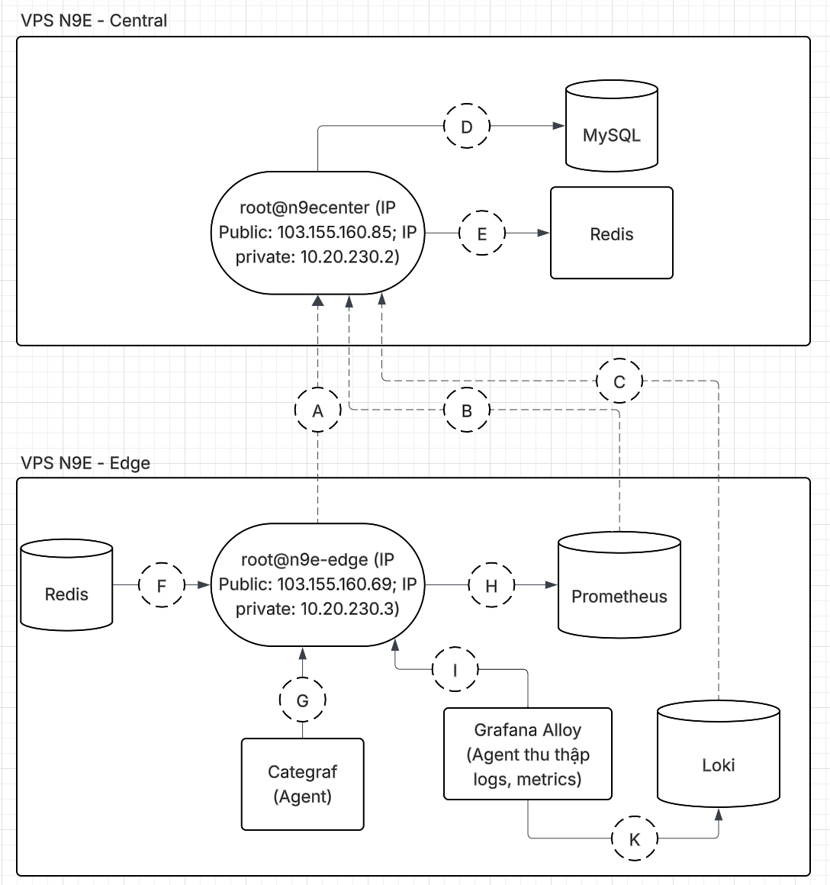

# SƠ LƯỢC VỀ N9E

* **N9E** là dự án mã nguồn mở có khả năng tích hợp các data sources tương tự như Grafana Dashboard nhưng nổi trội hơn về phần cảnh báo (alerting)
* **N9E** có thể truy vấn dữ liệu từ các data sources mà tích hợp vào nó như Promethues, Grafana Loki, ElasticSearch,... phục vụ cho việc tạo sự kiện cảnh báo(alarm event) và gửi thông báo về các kênh thông báo phổ biến như Slack, Telegram, Discord,...

## Mô hình đơn giản đã triển khai 

## Chi tiết các thành phần trong mô hình

* Luồng **A**: **n9e-edge** sẽ đồng bộ các thông tin mà **n9ecenter** lưu trữ ở **MySQL** như notify_rule, datasource, alert_rule,... phục vụ cho việc cảnh báo dựa trên các rules khi bị mất kết nối với **n9ecenter** (nhưng sẽ không thể buffer alert event để gửi lại cho **MySQL** tại **n9ecenter** khi kết nối đã được khôi phục).
* Luồng **B**: **n9ecenter** sẽ dựa trên thông tin datasource đã cấu hình với **Prometheus** mà sẽ định kì truy cấp các dữ liệu metrics mà **Prometheus** lưu trữ dựa trên các cú pháp PromQL (Prometheus Query Language) đã được cấu hình sẵn phục vụ cho custom query, alert và dashboard.
* Luồng **C**: **n9ecenter** sẽ dựa trên thông tin datasource đã cấu hình với **Loki** mà sẽ định kì truy cấp các dữ liệu logs mà **Loki** lưu trữ dựa trên các cú pháp LogQL đã được cấu hình sẵn phục vụ cho custom query, alert.
* Luồng **D**: **n9ecenter** sẽ lưu các thông tin như users, notify_rule, datasource, alert_rule, alert_his_event,... vào **MySQL** dựa trên thao tác cấu hình của user ở giao diện **n9ecenter's** webUI.
* Luồng **E**: **n9ecenter** sẽ lưu các thông tin về **n9e-edge** VM như ipv4, cpu, kernel_version,... vào redis(cấu hình trong /opt/n9e/etc/config.toml).
* Luồng **F**: **n9e-edge** sẽ lưu các thông tin về chính **n9e-edge** VM như ipv4, cpu, kernel_version,... vào redis(cấu hình trong /opt/n9e-edge/etc/edge/edge.toml) và đồng bộ về **n9ecenter**.
* Luồng **G**: **Categraf** đóng vai trò là một collector agent thu thập metric/logs, nhưng ở mô hình này thì chỉ thực hiện phản hồi [heartbeat] về **n9ecenter**(cấu hình ở n9e-edge:/opt/categraf/conf/config.toml).
* Luồng **H**: **Grafana Alloy** sẽ thu thập metrics của **n9e-edge** VM bao gồm các thông tin về disk, cpu, ram, network,... sau đó gửi đến HTTP endpoint của **n9e-edge**(cấu hình tại /etc/alloy/config.alloy) và sẽ được **n9e-edge** chuyển tiếp đến **Prometheus** để lưu trữ cho việc truy vấn(cấu hình tại phần [[Pushgw.Writers]] - /opt/n9e-edge/etc/edge/edge.toml).
* Luồng **I**: nhận metrics được chuyển tiếp từ **Grafana Alloy** đến **n9e-edge** và lưu vào **Prometheus**.
* Luồng **K**: nhận logs theo cấu hình của **Grafana Alloy**(/etc/alloy/config.alloy) và chuyển đến lưu trữ tại **Loki**.
### Tham khảo thêm
* [Details N9E architecture](https://lucid.app/lucidchart/f328617b-e8ff-49a5-85c0-2bc6577aec5b/edit?invitationId=inv_36d7034b-1599-4e6f-bb9e-c45f04a3ede2)
