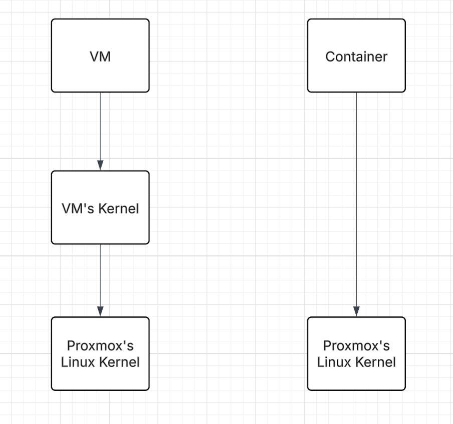

# SƠ LƯỢC VỀ PROXMOX

* **Proxmox Virtual Environment** là giải pháp quản lí ảo hóa mã nguồn mở. Phát triển dựa trên QEMU/KVM và LXC. Tại đây ta có thể quản lí VM, Linux Container, HA Cluster, Storage và Network thông qua 1 giao diện Web UI tập trung.
* **KVM (Kernel-based Virtual Machine)** là công nghệ ảo hóa được tích hợp vào kernel với dạng module phục vụ cho việc tạo và khởi chạy Linux, Window VMs với phần tài nguyên tách biệt cho riêng VM đó, chạy kernel của riêng nó.  
* **QEMU** là thành phần để quản lý các tài nguyên được ảo hóa, điều khiển quân cờ **"KVM (Kernel-based Virtual Machine)"** ảo hóa tài nguyên theo yêu cầu.  
* **Linux Containers (LXC)** là công nghệ ảo hóa ở mức độ OS level, **LXC** có thể khởi chạy nhiều linux container trên host linux đơn lẻ, dùng chung kernel với linux đơn lẻ đó. Cách ly qua namespace \+ cgroups.  
* **Về hiệu năng:** Container có hiệu năng cao hơn và nhẹ hơn do dùng chung Proxmox's Linux Kernel; 

