# Các bước Cài đặt - Cấu hình cơ bản Proxmox 9

## Cài đặt Proxmox 9 lên máy chủ vật lí

## Cấu hình network, package repository link, update package

### Cấu hình network
* Sau khi truy cập vào Proxmox UI theo link https://proxmox_ip:8006. Thực hiện click vào host **proxmox** cần cấu hình -> **System** -> **Network**.
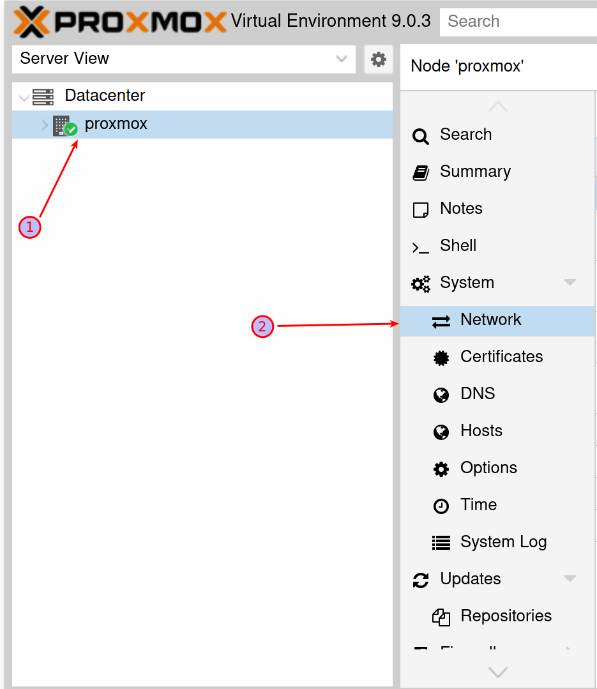

* Chọn **Create** -> **Linux Bridge**. 
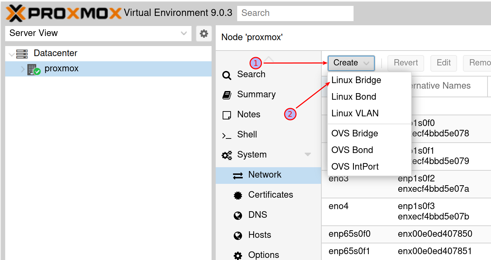

* Sau đó sẽ hiện một form dialog để điền thông tin của linux bridge **vmbr0**. Ta sẽ thực hiện điền các thông tin về **IPv4** đã route tới cổng vật lí **eno1**. Sau đó click chọn **Create**.
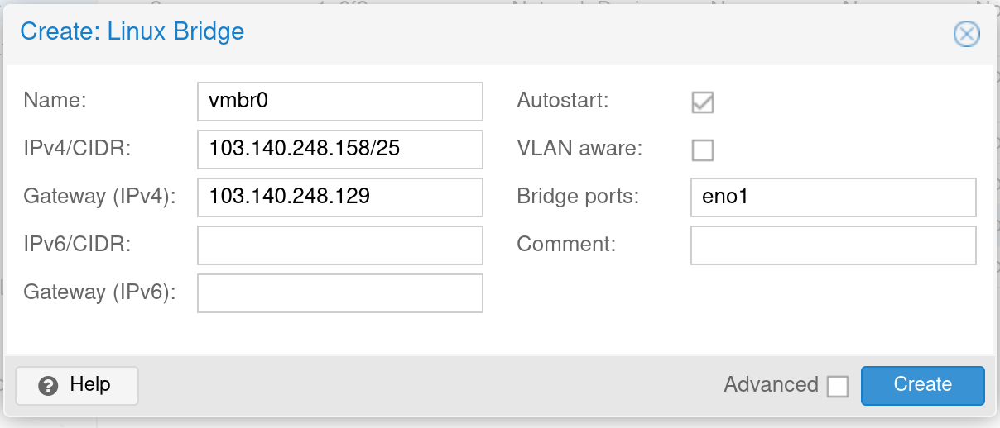
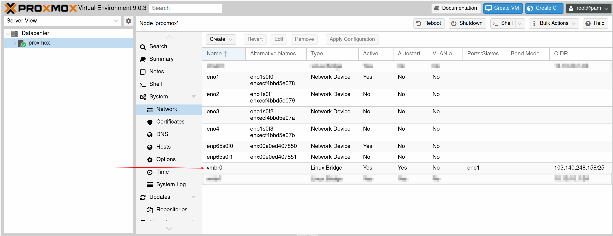

* Ta có thể kiểm tra lại ở file cấu hình network trên **proxmox** host
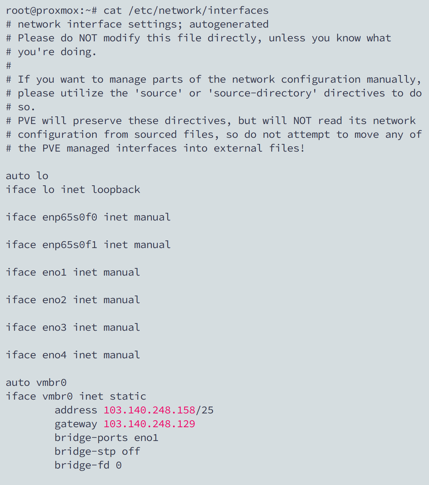

### Cấu hình repository link, update packages
* Truy cập mục quản lí **Repositories** thông qua **proxmox** -> **Updates** -> **Repositories**
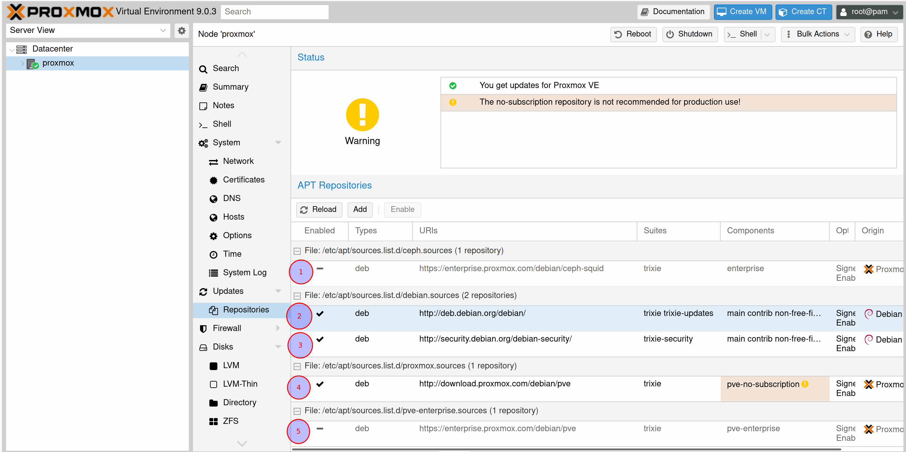
* Ta sẽ vô hiệu repo link (1), (5) do 2 repo đó yêu cầu phải có subscription key để tránh các lỗi không mong muốn(nếu có key thì có thể import để được nhận các bản package update tối ưu).
* Kích hoạt repo link (2), (3) để có thể cài đặt, cập nhật(update), nâng cấp(upgrade) package Debian-based(Proxmox chạy trên Debian OS); và kích hoạt repo link (4) để nhận update/ upgrade cho các gói pve-manager, qemu-server, pve-kernel, pve-cluster,... (các thành phần để quản lí **proxmox** host, VM, LXC). Đối với repo link (4) thì không khuyến khích kích hoạt trên môi trường vận hành(production) để tránh tự động nâng cấp(upgrade) các package lên phiên bản không ổn định -> **proxmox** host có thể hoạt động không ổn định.
* Truy cập **Shell** và chạy lệnh sau để update và upgrade packages lên phiên bản mới
  ```
  apt update && apt full-upgrade -y
  ```

## Các bước khởi tạo VM từ file ISO

### Khởi tạo Linux Ubuntu Server 22.04.05 LTS VM
* Đầu tiên, ta cần tải file ISO từ [Ubuntu Release](https://releases.ubuntu.com/jammy/) về ổ đĩa mà ta muốn cài **Linux VM** lên đó
  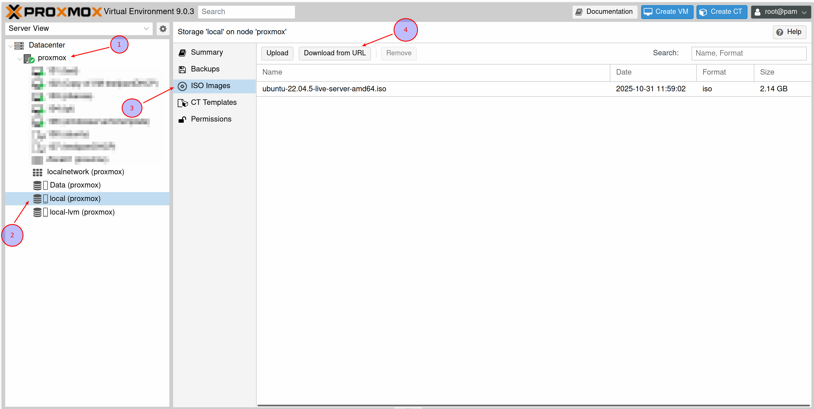
* Sau khi click chọn **Download from URL** thì sẽ hiện ra một form dialog để dán - xác thực link tải và tải về
  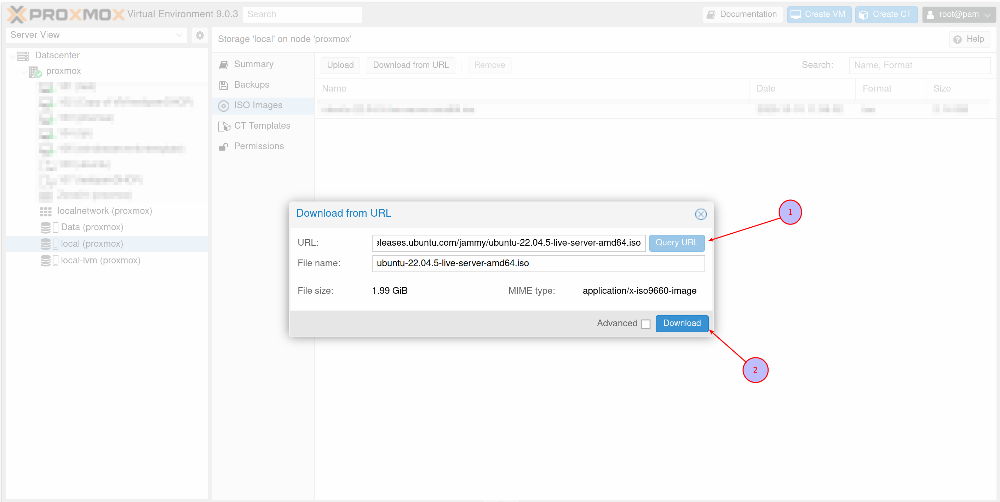
* Khi đã tải xong thì file ISO sẽ hiển thị như trong ảnh:
  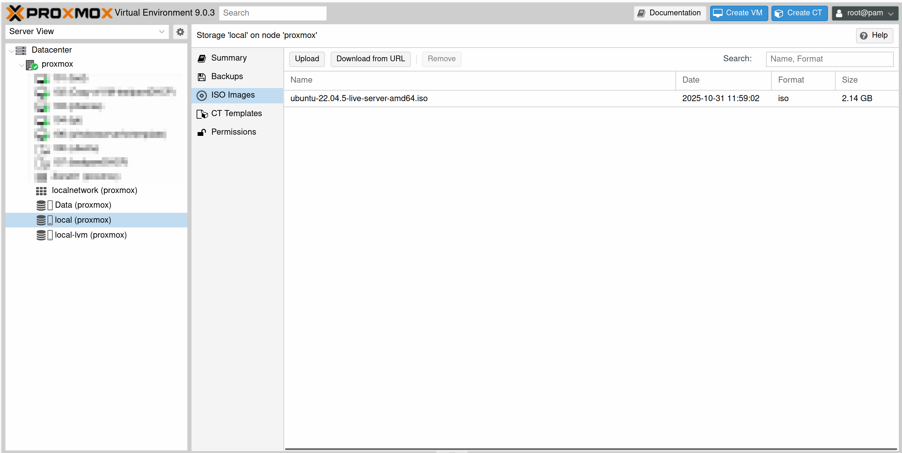
* Tiếp đến, ta click chọn **Create VM** để bắt đầu khởi tạo VM
  
* Điền tên VM vào trường **Name** và chọn **Next**
  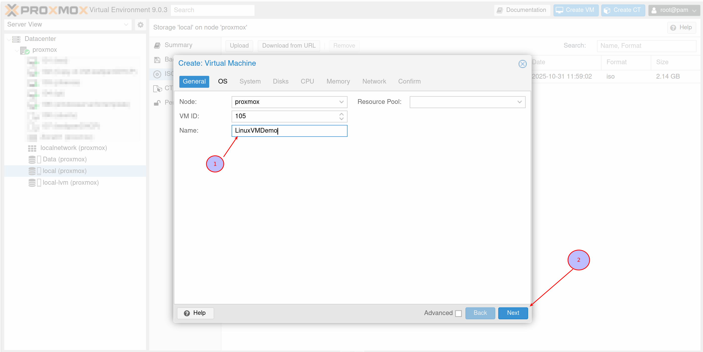
* Ở **Storage**, ta chọn ổ đĩa lưu file ISO đã tải ở bước trước, sau đó chọn file ISO ở trường **ISO image** và chọn **Next**
  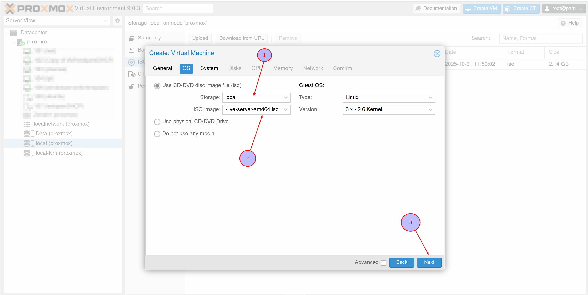
* Ở bước này, ta chọn **Qemu Agent** để cho phép cài đặt **QEMU Guest Agent** lên VM và bấm **Next** 
  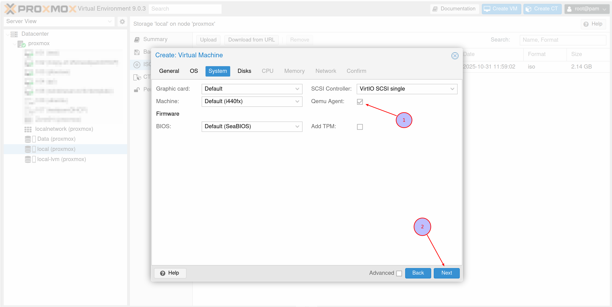
  > **QEMU Guest Agent** khi chạy trên VM sẽ cho phép thiết lập 1 kênh giao tiếp giữa Qemu trên **proxmox** host với VM -> để các lệnh thực thi do Qemu tác động lên VM có thể hoạt động mượt mà/ ổn định; ví dụ như cấp phát IP tự động từ subnet trên SDN qua pve-IPAM; backup; start/stop/shutdown command;...
* Bước này là bước chọn ổ lưu trữ VM tại trường **Storage** mà ta muốn cài OS từ file ISO với mức giới hạn dung lượng (GB) cấp phát cho VM tại **Disk size**, ta có thể tùy chỉnh **Disk size** tùy theo mục đích sử dụng, và click **Next**
  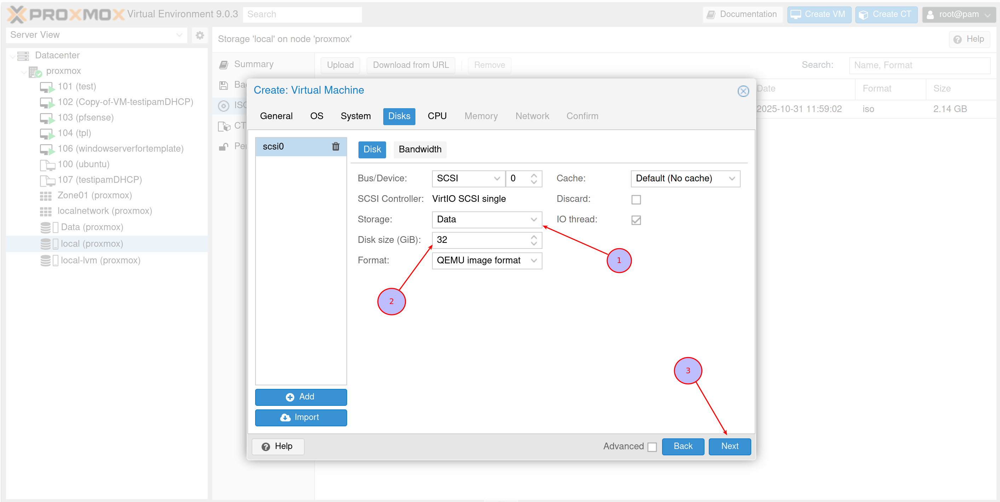
* Nếu muốn gán nhiều nhân CPU hơn cho VM thì ta có thể thay đổi ở phần **Cores** và click **Next**
  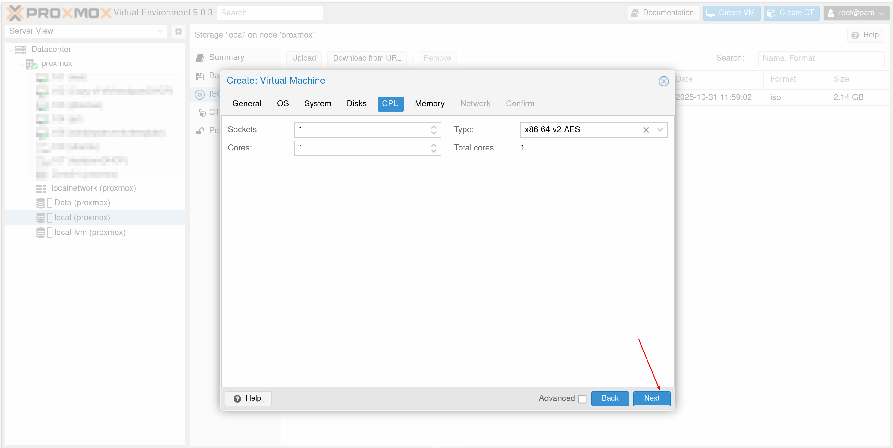
* Tương tự như ở bước trước, ta có thể điều chỉnh dung lượng RAM gắn cho VM ở phần **Memory (MiB)** và click **Next**
  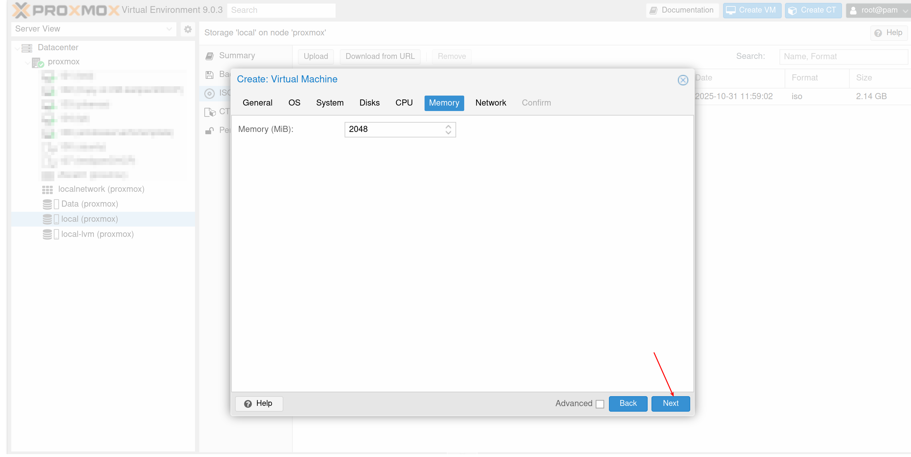
* Ở trường **Bridge**, chọn NIC thích hợp tùy theo nhu cầu/ mục đích của VM đó, và bấm **Next**
  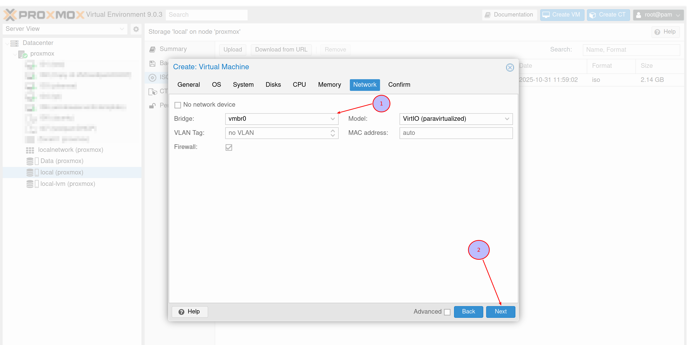
* Ở bước này, ta xem lại các thông số của VM, nếu thấy đã ổn thì bấm **Finish** để tạo VM
  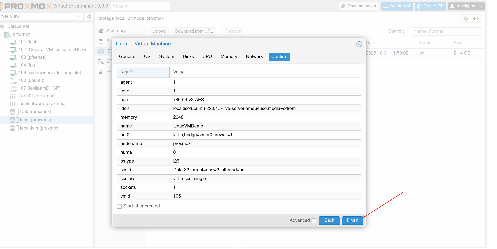  
* Sau khi tạo VM thành công thì ta bấm **Start** để khởi chạy VM, click **Console** truy cập VM và bắt đầu quá trình cài đặt
  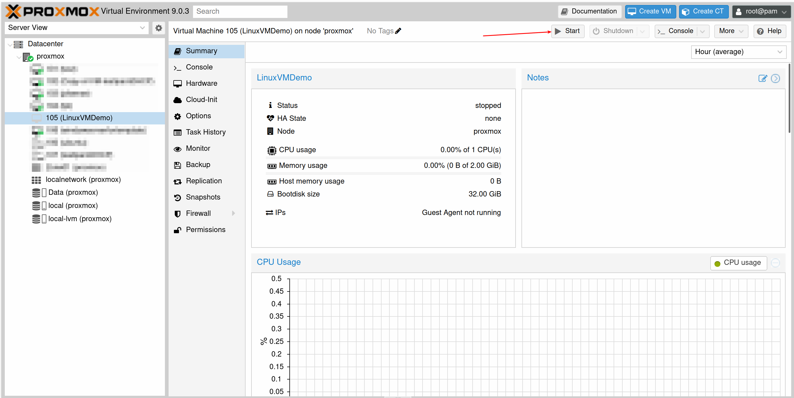
  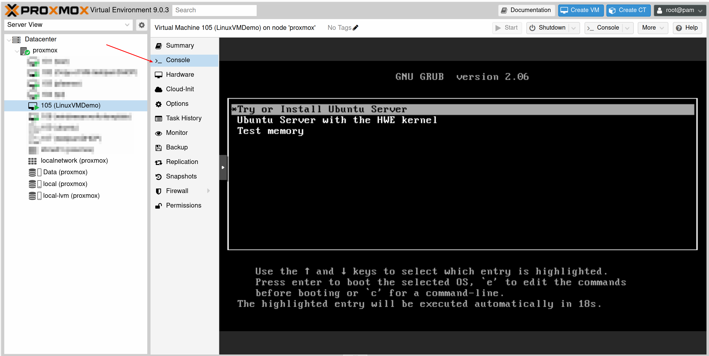

### Khởi tạo Windows Server 2019 VM
* Đầu tiên, ta cần tải file ISO, driver ảo VirtIO từ [Windows Server 2019 download](https://www.microsoft.com/en-us/evalcenter/download-windows-server-2019) và [VirtIO-Win](https://fedorapeople.org/groups/virt/virtio-win/direct-downloads/archive-virtio/?C=M;O=D) về ổ đĩa mà ta muốn cài **Window Server VM** lên đó
  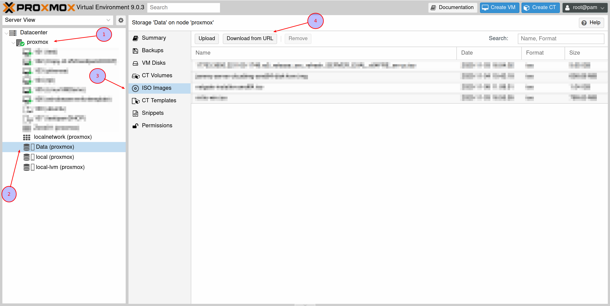
* Sau khi click chọn **Download from URL** thì sẽ hiện ra một form dialog để dán - xác thực link tải và tải về (làm tương tự so với file VirtIO-Win)
  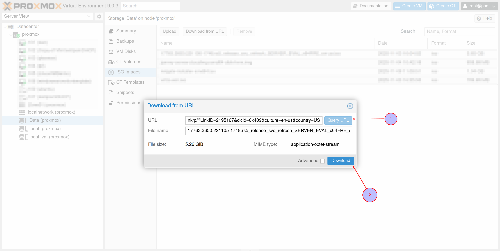
* Khi đã tải xong thì file ISO sẽ hiển thị như trong ảnh:
  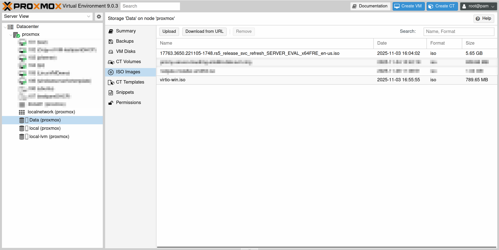
* Tiếp đến, ta click chọn Create VM để bắt đầu khởi tạo VM
  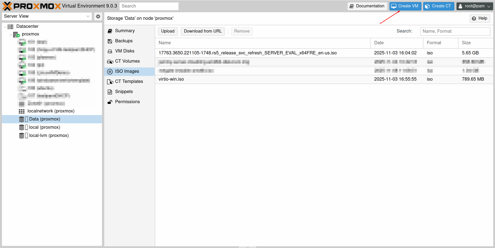

  
  

## Sơ lược về các thành phần cơ bản trong giao diện Proxmox


