# Storage trong Proxmox

## Sơ lược
* Về phạm vi lưu trữ chia thành 2 loại
  * **Local Storage**: là các disk được gắn/nhận dạng vào node proxmox và chỉ được sử dụng bởi các VM/Container trong chính node proxmox đó. Khi di chuyển VM sang disk khác thì ta dùng tính năng **Move Storage**.
    
  * **Shared Storage**: bao gồm nhiều disks gộp lại thành một disk logic mà cluster nhìn thấy - cấp phát cho các node proxmox sử dụng. Dạng storage này có phần nổi trội hơn **Local Storage** bởi việc **live-migrate** được thực hiện gần như tức thì - disk của VM nằm trong **Shared Storage** mà cluster (nhiều node proxmox) có thể truy cập trực tiếp được; vì thế, khi thực hiện live-migrate giữa các node proxmox thì chỉ cần chuyển trạng thái RAM, CPU.  
* Có hai cấp độ lưu trữ mà Proxmox hỗ trợ: bao gồm **File level storage** và **Block level storage**. Với mỗi loại lưu trữ như **ZFS, LVM, Directory, LVM-thin,...** đều được proxmox định nghĩa/điều khiển nhờ vào gói **libpve-storage-perl**  - gói này bao gồm các plugin/module định nghĩa cho từng loại lưu trữ **(zfspool, lvm, dir, lvmthin,...)**.
  
* **Thin Provisioning** là tính năng mà ở đó VM sẽ chỉ sử dụng phần disk mà VM thực sự đang dùng (ví dụ: nếu cấp phát cho VM 30GB Disk, mà OS + App chỉ sử dụng 5GB, thì 25GB còn lại có thể được sử dụng bởi các VM khác. Ngược lại, thì sẽ cấp phát đầy đủ 30GB Disk chỉ cho VM đó).
  > Cần lưu ý đảm bảo để trống vùng disk phù hợp với nhu cầu ghi dữ liệu của các VM, tránh hiện tượng **over-provisioning** - là hiện tượng mà VM ghi dữ liệu thỏa mản dung lượng disk tối đa được cấp phát nhưng lại không thoả lượng disk thực tế còn trống gây hỏng dữ liệu.
> Tất cả các cấu hình liên quan đến storage đều được lưu trữ ở file **/etc/pve/storage.cfg**
> 
* Về các thuộc tính chính của storage
  * **ID**: tên định danh duy nhất của storage được proxmox nhận dạng trong **/etc/pve/storage.cfg**
  * **Content**: các loại dữ liệu mà loại storage đó hỗ trợ lưu trữ.
    > * Với loại storage là **Directory** thì hỗ trợ **file level** nên sẽ support các dạng lưu trữ như hình
    > 
    > * Đối với **LVM-Thin** - chỉ hỗ trợ **block level** nên chỉ có thể support **Disk image** và **Container**
    > 
  * **Nodes**: chỉ các **proxmox node** có quyền tương tác/đọc - ghi dữ liệu đối với storage tương ứng
  * **Enable**: khi bỏ tick tùy chọn này thì sẽ ngắt mọi giao tiếp từ thao tác trên giao diện proxmox liên quan đến **Hard Disk** thực thi lên storage tương ứng.
    > 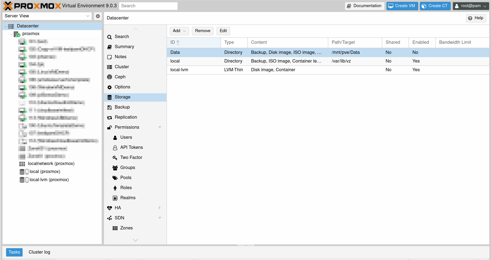
    > * VM ở trạng thái **running**: sẽ không thể tương tác với disk thuộc Storage đã bỏ tick **Enabled** như **Resize** (báo lỗi như hình), **Add** Hard Disk (không hiện disk để **Add**); ở trong VM thì vẫn có thể thực hiện các thao tác sao chép, di chuyển, tải dữ liệu từ Internet bình thường.
    >   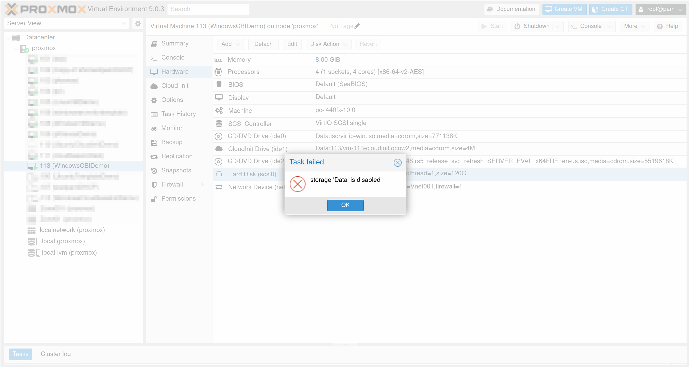
    >   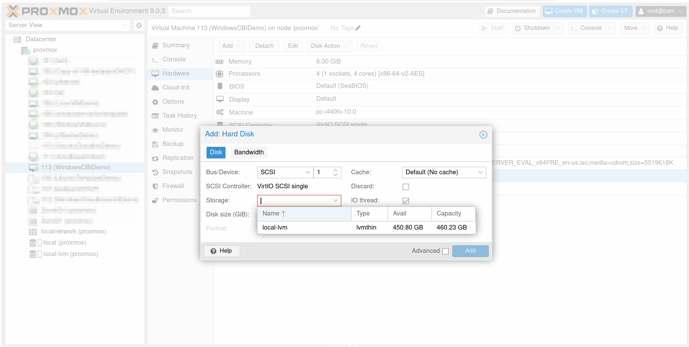
    > * VM ở trạng thái **stop**, **shutdown** thì sẽ không thể **Start** lại được nữa, và sẽ báo lỗi như hình - **proxmox node** không còn quyền đọc/ghi dữ liệu của VM Disk để khởi động VM
    >   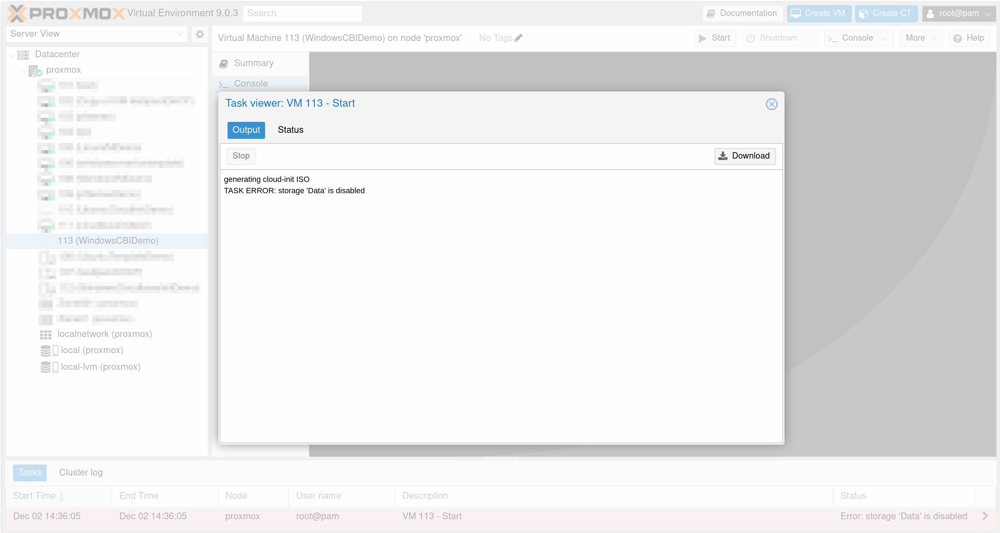
    > * Ở phía giao diện **Shell** của proxmox node thì vẫn có thể thao tác đọc/ghi dữ liệu bình thường
    >   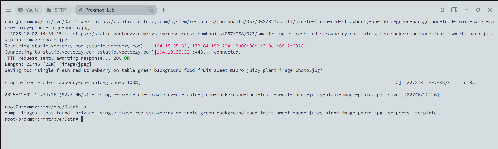
    
## LVM, ZFS

### LVM
* Có ba định nghĩa cốt lõi:
  * **Physical Volumes (PV)**: là các thiết bị lưu trữ như ổ đĩa SSD/HDD được **LVM** đánh dấu dùng cho việc quản lí.
  * **Volume Group (VG)**: gộp tất cả các **PV** thành một ổ thống nhất mà OS nhìn thấy gọi là **VG**.
  * **Logical Volume (LV)**: là các "mảnh" phân vùng lấy từ **VG** để cấp phát cho các VM, các VM nhận dạng **LV** như các ổ đĩa ảo để lưu trữ dữ liệu
  > Trong **LVM**, nếu một ổ bị hỏng thì sẽ làm hỏng toàn bộ dữ liệu nằm trên các ổ còn lại - bởi vì OS + VM xem **LV** là một ổ thống nhất.
* Sơ đồ tổng quát:
  
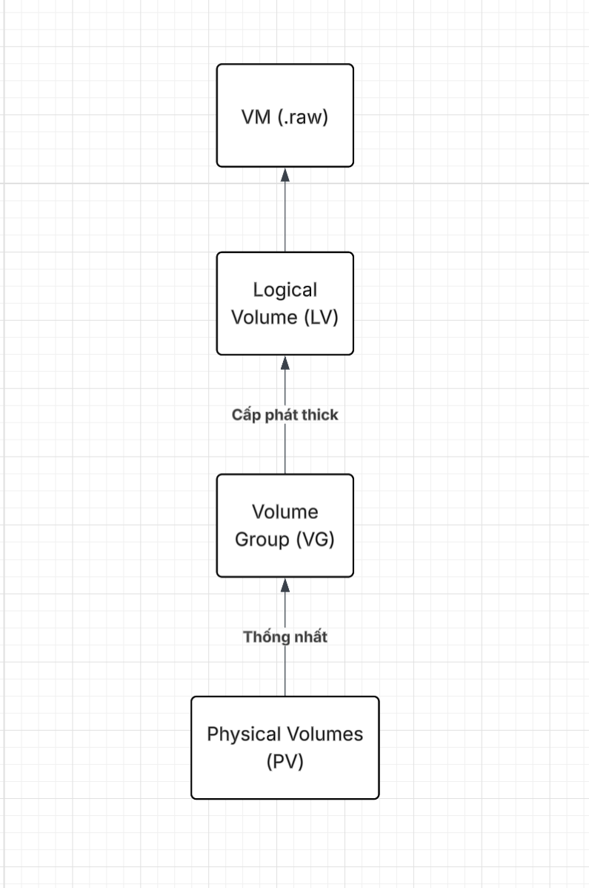

### LVM-Thin
* Cũng là **LVM** nhưng có hỗ trợ **thin provisioning** thông qua việc tạo thêm **Thin Pool** từ **VG** - để tạo được **LVM-Thin** thì cần phải có **VG** từ **LVM**
  > * **Thin Pool** tồn tại trên block-level storage là để hình thành cơ chế **thin provisioning** mà block-level storage không có (VM sẽ lấy disk ảo từ **Thin Pool** để làm virtual **Hard Disk** cho chính VM đó)
  > * **Thin provisioning** là tính năng giúp tiết kiệm dung lượng disk - phần disk đã cấp phát cho VM mà VM đó chưa dùng thì có thể được sử dụng bởi VM khác.
  >   * Ví dụ: Cấp phát 100GB cho Linux VM nhưng chỉ dùng có 10GB thì 90GB còn lại có thể dùng cho VM khác, Linux VM đó vẫn có thể sinh dữ liệu trong quá trình vận hành cho tới khi đạt mức giới hạn tối đa đã cấp phát là là 100GB.
  >   * Vì thế, sẽ gây nên rủi ro gọi là **over-provisioning** - đặt ở trường hợp Linux VM trên, VM nhìn thấy còn trống 90GB mà disk thực tế còn trống chỉ có 10GB, thì khi Linux VM trên ghi 20GB dữ liệu vào disk sẽ làm dữ liệu có khả năng bị hỏng/ mất tính nhất quán của dữ liệu -> Cần monitor storage (cảnh báo khi disk đạt 80-90% tùy vào dung lượng disk/ mức độ tương tác thường xuyên của hệ thống lên disk đó) để tránh **over-provisioning**.
* Ta có thể tạo nhiều **Thin Pool** từ **VG** để quản lí rủi ro tùy theo nhu cầu - mục đích. Ví dụ, ta có thể tạo hai **Thin Pool**, một pool để chạy các VM trong môi trường production, một pool dùng cho mục đích test/kiểm thử; nếu pool dùng để test/kiểm thử bị **over-provisioning** thì sẽ không ảnh hưởng đến pool dùng để cấp phát cho VM chạy trong môi trường production.
* Các loại storage có hỗ trợ **thin provisioning** đều hỗ trợ **Snapshot**, nhưng chỉ với VM lưu **Hard Disk** ở định dạng **.qcow2**, còn ở định dạng **.raw** thì không.
* Sơ đồ tổng quát:

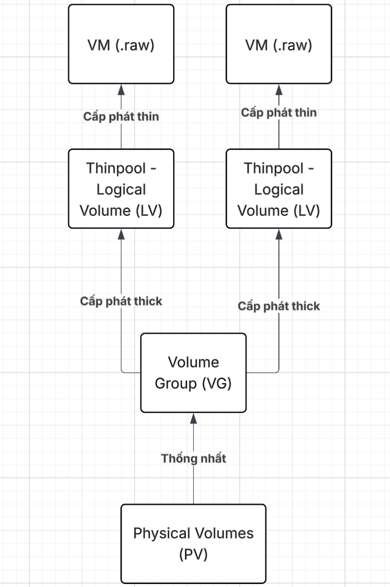

> 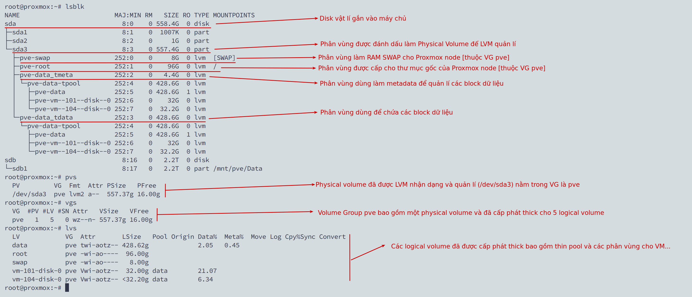

### Demo tạo Storage LVM, LVM-Thin trên file giả lập
* Tạo file ảo 200GB trên storage Directory - **Data**
  ```
  truncate -s 200G /mnt/pve/Data/LVM_DiskLab.img
  ```
* Biến file rỗng thành ổ đĩa ảo
  ```
  losetup -fP /mnt/pve/Data/LVM_DiskLab.img
  ```
  ```
  losetup -a
  ```
* Tạo Physical Volume (PV) từ ổ đĩa ảo trên - đánh dấu phân vùng đó cho LVM quản lí
  ```
  pvcreate /dev/loop0
  ```
* Tạo Volume Group (VG)
  ```
  vgcreate vg_lab /dev/loop0
  ```
* Tạo **Thin pool** cho **LVM-Thin** storage chiếm 60% dung lượng của Volume Group **vg_lab**
  ```
  lvcreate -l 60%FREE --thinpool thinpool_lab vg_lab
  ```
  > 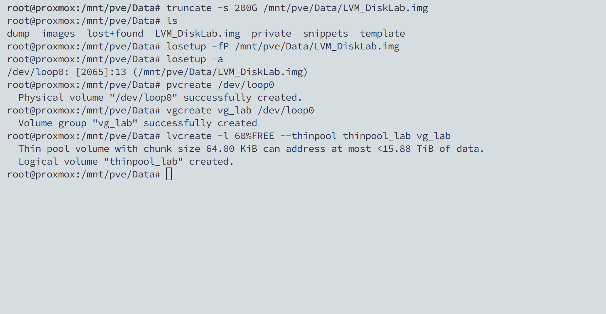
  
* Khai báo hai storage trên vào Proxmox
  * Thêm **LVM** Storage
    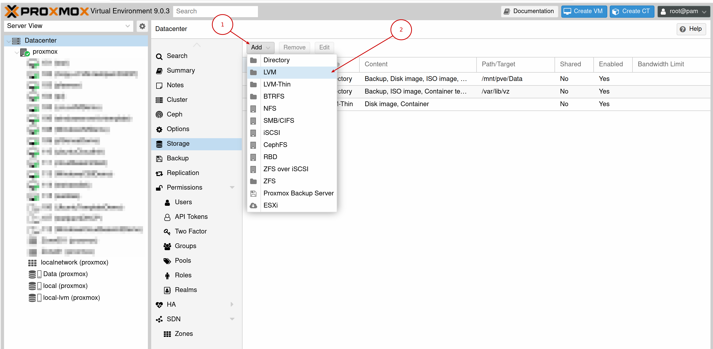
  * Điền **ID**, chọn **Volume group** tương ứng và click **Add**
    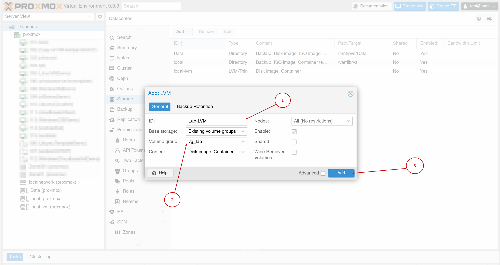
    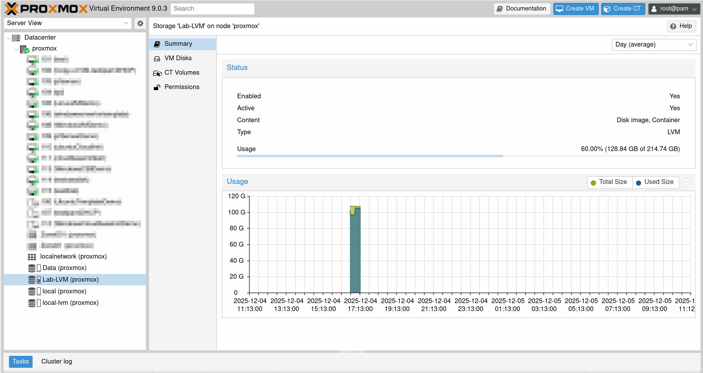
  * Thêm **LVM-Thin** Storage
    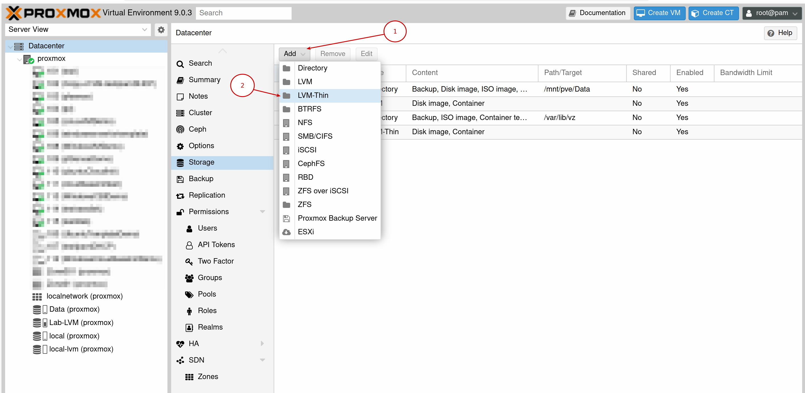
  * Điền **ID**, chọn **Volume group**, **Thin Pool** tương ứng và click **Add**
    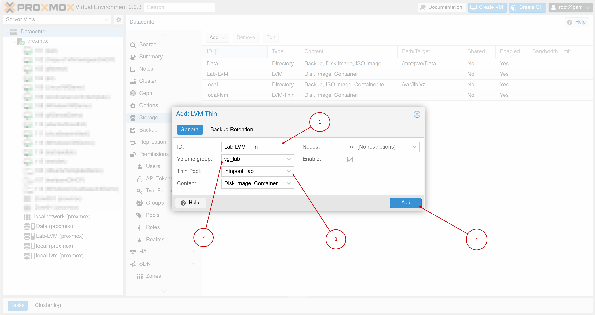
    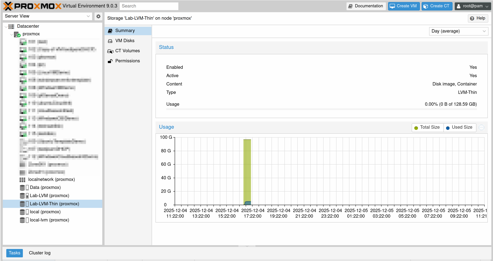
    
> * VM trên **LVM** storage
>   * Trước khi tạo VM
>     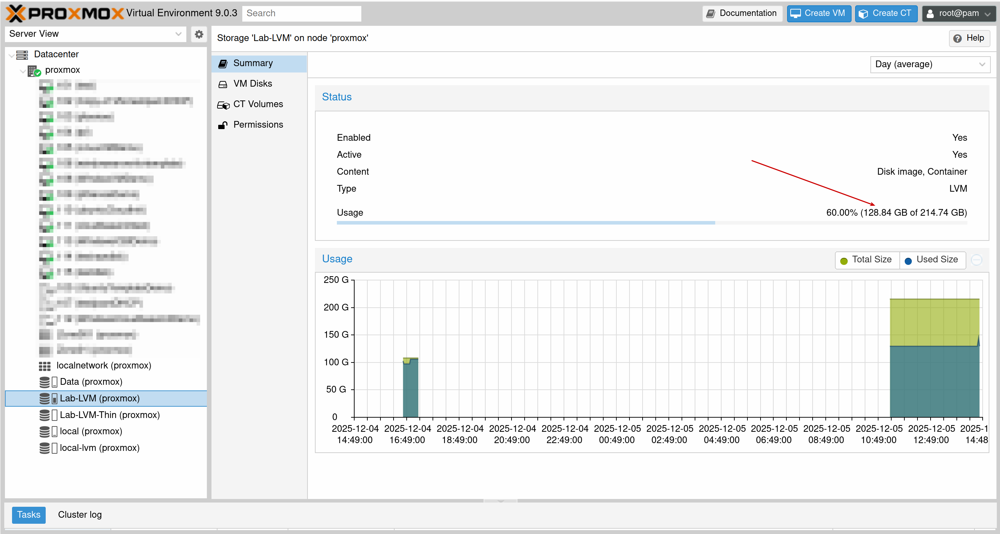
>   * Sau khi tạo VM
>     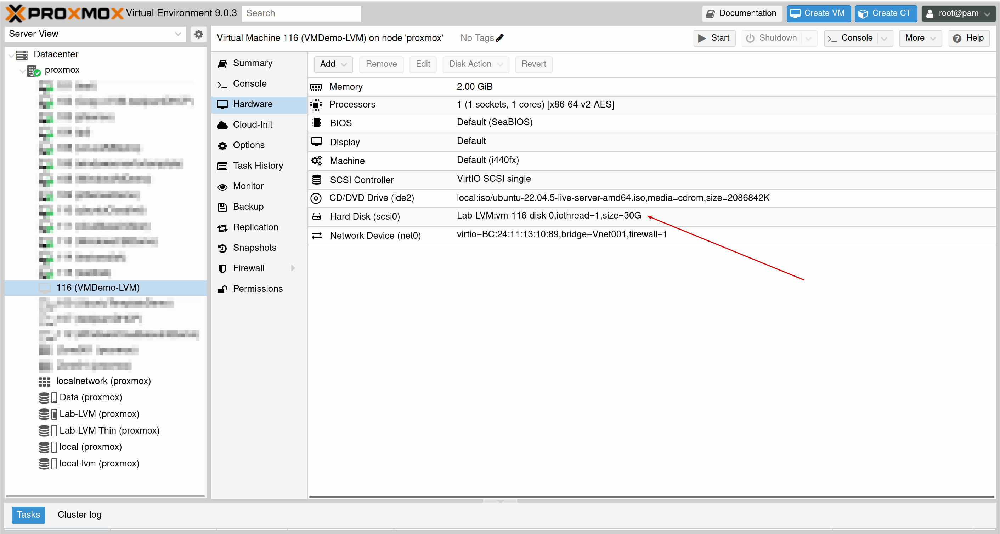
>     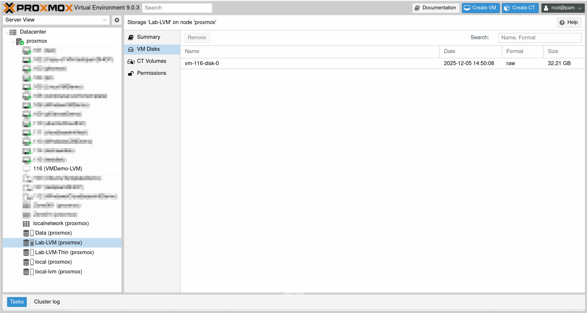
>     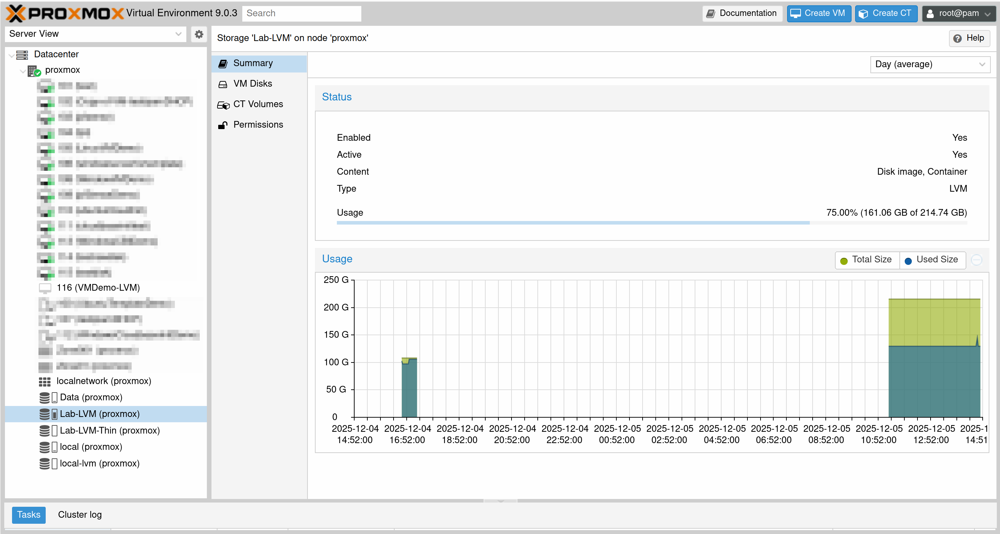
>   * Như các hình trên thì ta thấy VM khi tạo trên **LVM** storage thì disk VM khởi tạo bao nhiêu thì sẽ được cấp phát hết mặc dù VM chưa dùng hết phần disk cấp phát đó.
> * VM trên **LVM-Thin** storage
>   * Trước khi tạo VM
>     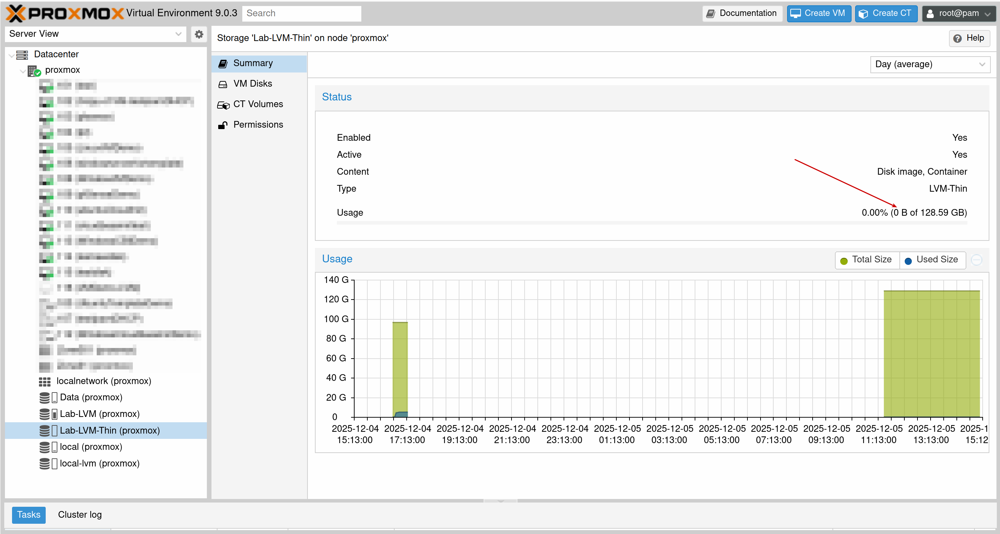
>   * Sau khi tạo VM
>     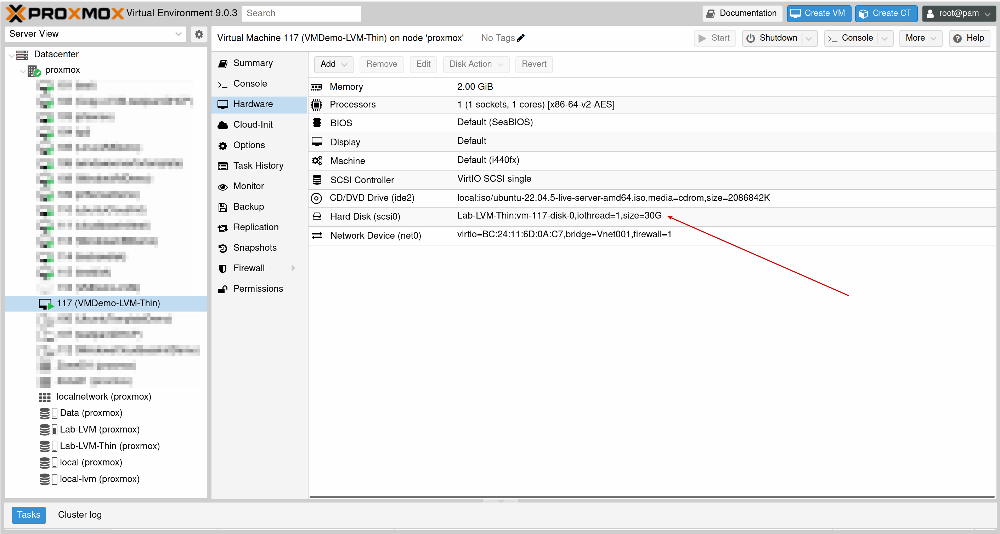
>     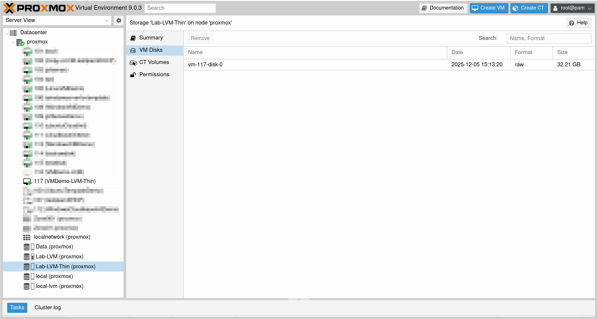
>     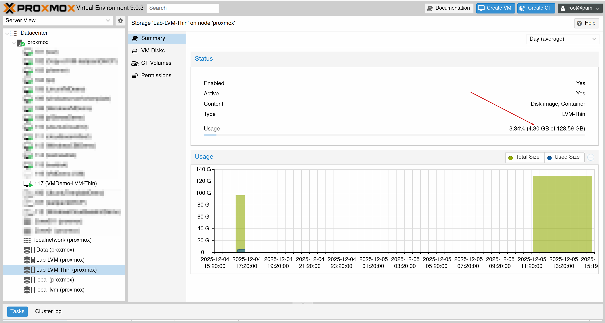
>   * Vì **LVM-Thin** hỗ trợ **Thin Provisioning** nên sẽ chỉ chiếm phần disk - **LVM-Thin** Storage mà VM thực sự dùng, chứ không chiếm hết tất cả phần disk mà đã được cấp phát.
> * **Snapshots**
>   * Do cơ chế lưu trữ dữ liệu trên **LVM-Thin** và **LVM** khác nhau nên VM được lưu trữ trên **LVM-Thin** sẽ hỗ trợ tính năng**Snapshots** còn **LVM** thì không.
>     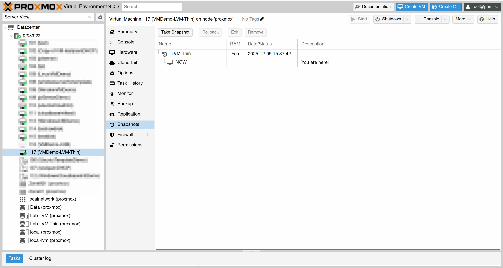
>     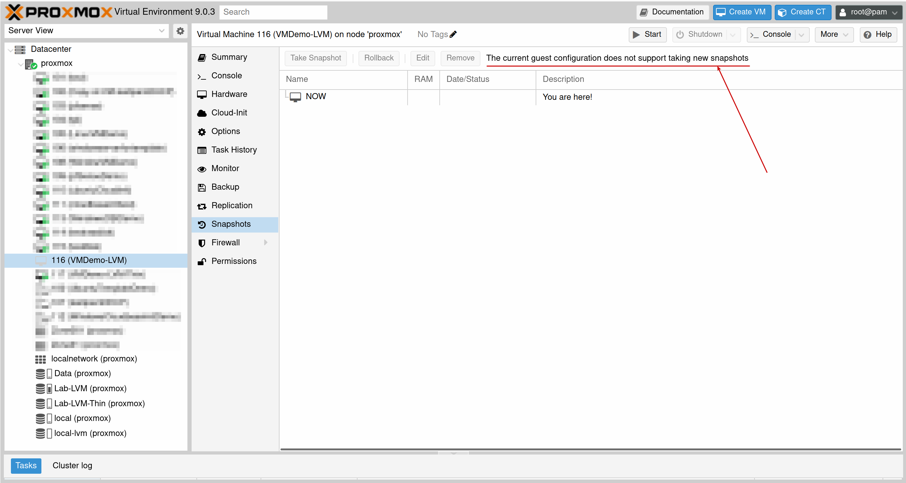

### ZFS


> ZFS: cần nắm rõ các định nghĩa về VDEV (tương đương PV ở LVM nhưng có thể tích hợp RAID mềm, và có thể tạo nhiều cụm RAID tùy mục đích vận hành); ZPOOL(bao gồm các VDEV gộp lại thành 1 virtual disk duy nhất tương đương VG trên LVM; chỉ cần 1 DEV offline là sẽ làm hỏng toàn bộ ZPOOL); Dataset (là phân vùng được cấp phát từ ZPOOL - ở định dạng block-level storage làm ổ cứng cho các máy ảo tương đương LV trên LVM), ZVOL (là phân vùng được cấp phát từ ZPOOL - dùng như một folder, có thể dùng để chứa file, ISO Images,...); Checksum (kiểm tra tính toàn vẹn của dữ liệu lúc đọc và ghi); CoW (Copy on Write - cần đảm bảo pool còn trống để ghi metadata mới ghi xóa dữ liệu)
> Yêu cầu về hardware: ZFS cần nhiều RAM để xử lí hơn so với LVM; SSD
> Nắm rõ các cơ chế cache - tối ưu tốc độ xử lí trong ZFS Storage (L2ARC); Ưu và nhược điểm của cơ chế này; Demo đối chiếu giữa có dùng và không dùng cache
> Các loại RAID và ưu/nhược điểm từng loại mà Proxmox hỗ trợ


