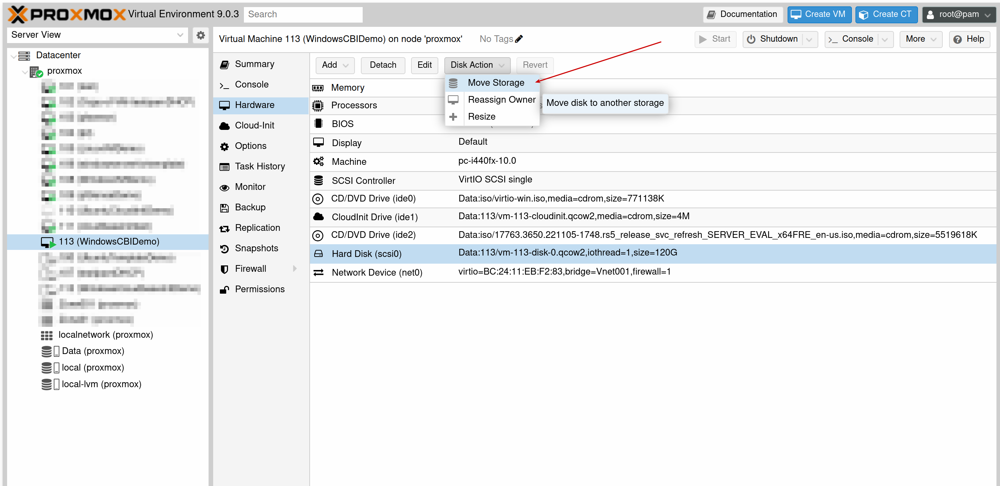
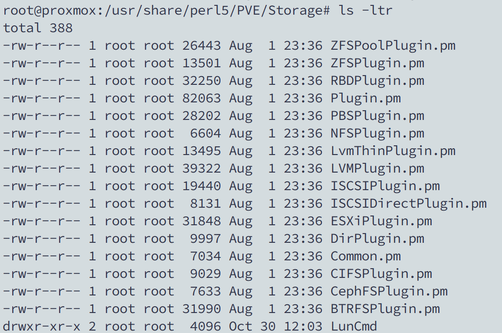
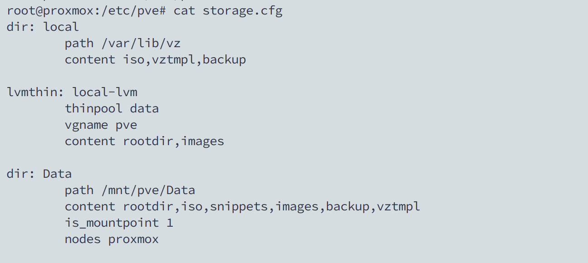
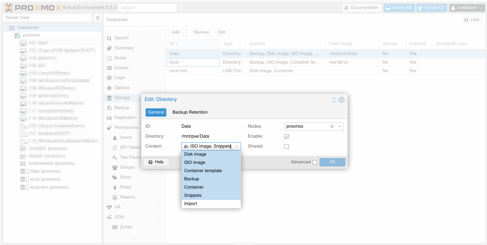
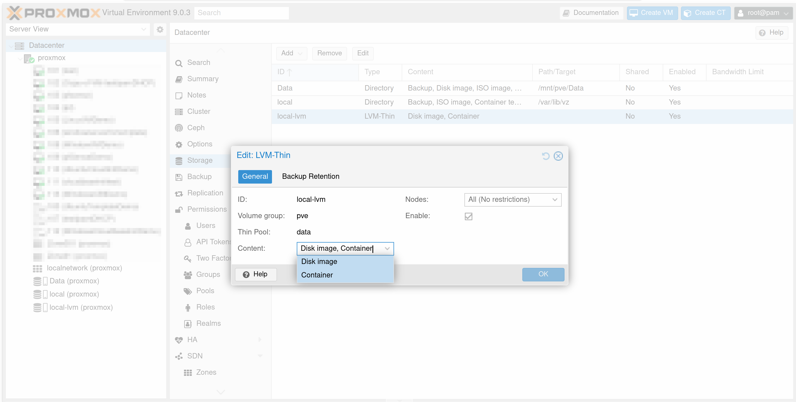

# Storage trong Proxmox

## Sơ lược
* Về phạm vi lưu trữ chia thành 2 loại
  * **Local Storage**: là các disk được gắn/nhận dạng vào node proxmox và chỉ được sử dụng bởi các VM/Container trong chính node proxmox đó. Khi di chuyển VM sang disk khác thì ta dùng tính năng **Move Storage**.
    
  * **Shared Storage**: bao gồm nhiều disks gộp lại thành một disk logic mà cluster nhìn thấy - cấp phát cho các node proxmox sử dụng. Dạng storage này có phần nổi trội hơn **Local Storage** bởi việc **live-migrate** được thực hiện gần như tức thì - disk của VM nằm trong **Shared Storage** mà cluster (nhiều node proxmox) có thể truy cập trực tiếp được; vì thế, khi thực hiện live-migrate giữa các node proxmox thì chỉ cần chuyển trạng thái RAM, CPU.  
* Có hai cấp độ lưu trữ mà Proxmox hỗ trợ: bao gồm **File level storage** và **Block level storage**. Với mỗi loại lưu trữ như **ZFS, LVM, Directory, LVM-thin,...** đều được proxmox định nghĩa/điều khiển nhờ vào gói **libpve-storage-perl**  - gói này bao gồm các plugin/module định nghĩa cho từng loại lưu trữ **(zfspool, lvm, dir, lvmthin,...)**.
  
* **Thin Provisioning** là tính năng mà ở đó VM sẽ chỉ sử dụng phần disk mà VM thực sự đang dùng (ví dụ: nếu cấp phát cho VM 30GB Disk, mà OS + App chỉ sử dụng 5GB, thì 25GB còn lại có thể được sử dụng bởi các VM khác. Ngược lại, thì sẽ cấp phát đầy đủ 30GB Disk chỉ cho VM đó).
  > Cần lưu ý đảm bảo để trống vùng disk phù hợp với nhu cầu ghi dữ liệu của các VM, tránh hiện tượng **over-provisioning** - là hiện tượng mà VM ghi dữ liệu thỏa mản dung lượng disk tối đa được cấp phát nhưng lại không thoả lượng disk thực tế còn trống gây hỏng dữ liệu.
> Tất cả các cấu hình liên quan đến storage đều được lưu trữ ở file **/etc/pve/storage.cfg**
> 
* Về các thuộc tính chính của storage
  * **ID**: tên định danh duy nhất của storage được proxmox nhận dạng trong **/etc/pve/storage.cfg**
  * **Content**: các loại dữ liệu mà loại storage đó hỗ trợ lưu trữ.
    > * Với loại storage là **Directory** thì hỗ trợ **file level** nên sẽ support các dạng lưu trữ như hình
    > 
    > * Đối với **LVM-Thin** - chỉ hỗ trợ **block level** nên chỉ có thể support **Disk image** và **Container**
    > 
    

