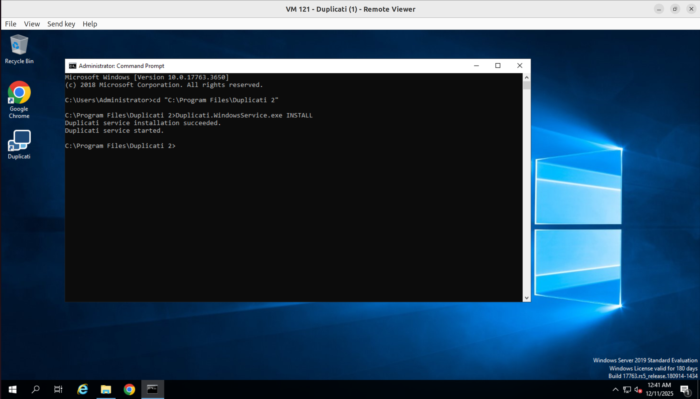
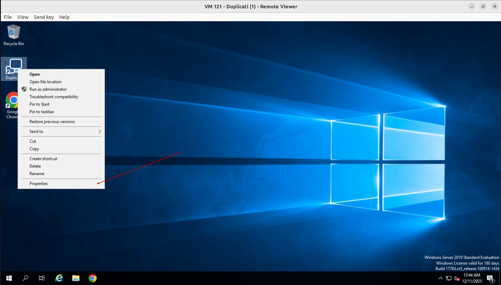
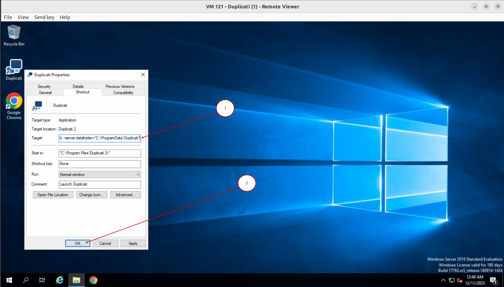
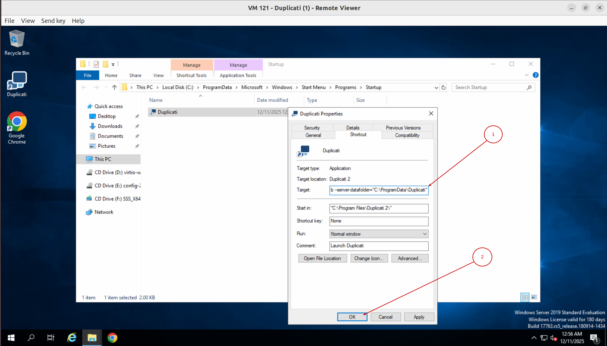
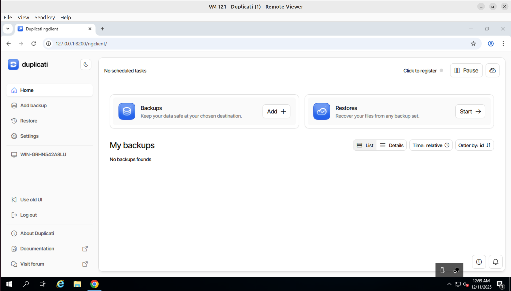

# Hướng dẫn tích hợp Duplicati với Cloud Object Storage S3 tại VNData dùng cho Sao lưu - Phục hồi dữ liệu
## Trên Windows Server
### Cài đặt Duplicati ở dạng Foreground App
* Đầu tiên, ta cần cài **Duplicati** trên Window qua đường link [Duplicati Download](https://duplicati.com/download)
  * Sau khi truy cập vào đường link trên, click chọn **Download for Windows**
    
  * Sau khi tải xong thì tiến hành chạy file cài đặt
    
  * Click **Finish**
    
* Tiếp theo, mở **Duplicati** qua **Tray icon** của ứng dụng **Duplicati**
  
* Có thể đặt **passphrase** ở bước này hoặc để sau
  
* Click **Settings** -> **Register on console** để cấu hình remote session
  
  
* Truy cập đường link trên và Đăng kí/Đăng nhập tài khoản **Duplicati**
  
* Click **Register machine**
  
  
* Click **Machines** -> **Details** -> **Start Session** để mở giao diện của **Duplicati** server trên Windows VM
  
* Click **Create** tại **Backups**
  
* Click **Add a new backup**
  
* Điền tên của job backup vào **Backup name**, điền mật khẩu vào **Create a password** và click **Continue**
  
  
* Tại phần **Destination** -> chọn **S3 Compatible**
  
* Nếu quý khách chưa có gói **Cloud Object Storage S3** để dùng cho việc backup thì có thể tham khảo các gói lưu trữ của [**VNData**](https://vndata.vn/) qua đường dẫn [**VNData - Cloud Object Storage S3**](https://vndata.vn/cloud-s3-object-storage-vietnam/)  
  
* Điền các thông tin tương ứng vào **Bucket Name** - tên bucket S3, **Folder path** - đường dẫn folder trong bucket đó, **Server** - điền thông tin tại phần **S3 ENDPOINT (HTTPS)** (bỏ phần "https"); tick chọn **Instruct Duplicati to use an SSL (https) connection**; điền lần lượt **Access Key Id**, **Secret Key** ở trang **S3 Portal - VNData** vào **AWS Access Key ID** và **AWS Secret Access Key**
  
  
* Sau khi điền xong thì click **Test destination**. Trả kết quả thành công thì bấm **Continue**
  
  
  
* Tại phần **Source Data**, chọn các file/thư mục cần sao lưu -> **Continue**
  
* Đặt lịch backup tại **Schedule** -> **Continue**
    
* Click **Submit**
  
  
* Click **Start** để chạy backup
  
  
* Như trong hình thì dữ liệu đã được backup và lưu thành công lên **Object Storage**
  
* Để **Restore** dữ liệu -> click **Start** tại mục **Restores**
  
* Bấm **Restore** với bản sao lưu mà bạn muốn phục hồi
  
* Chọn file/thư mục cần **Restore** và bấm **Continue** -> **Submit**
  
  
  

### Cài đặt Duplicati ở dạng WindowsService
* Tải và chạy file cài đặt **Duplicati**. Đến bước cuối cùng thì bỏ check **Launch Duplicati now** -> **Finish**
  
* Mở **CMD** với quyền **Administrator** và chạy lần lượt các lệnh sau
  ```
  cd "C:\Program Files\Duplicati 2"
  ```
  ```
  Duplicati.WindowsService.exe INSTALL
  ```
  
* Mở **Properties** của **Duplicati shortcut** ở màn hình Desktop và điền chuỗi sau vào trường **Target**:
  ```
  "C:\Program Files\Duplicati 2\Duplicati.GUI.TrayIcon.exe" --no-hosted-server --read-config-from-db --server-datafolder="C:\ProgramData\Duplicati"
  ```
  Và click **OK**
  
  
* Truy cập thư mục **C:\ProgramData\Microsoft\Windows\Start Menu\Programs\StartUp** hoặc chạy **Run** và thực thi lệnh **shell:common startup**. Điều chỉnh **Properties** của **Duplicati shortcut** tương tự bước trước
  
* Hoàn thành các bước trên thì ta có thể truy cập giao diện **Duplicati** và sử dụng các tính năng **Backup**, **Restore** như bình thường
  


