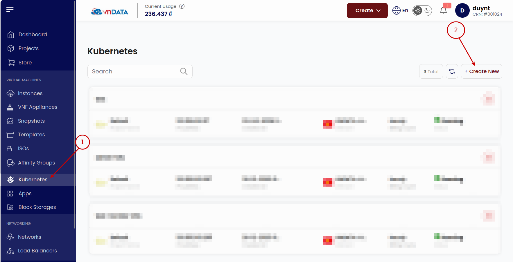
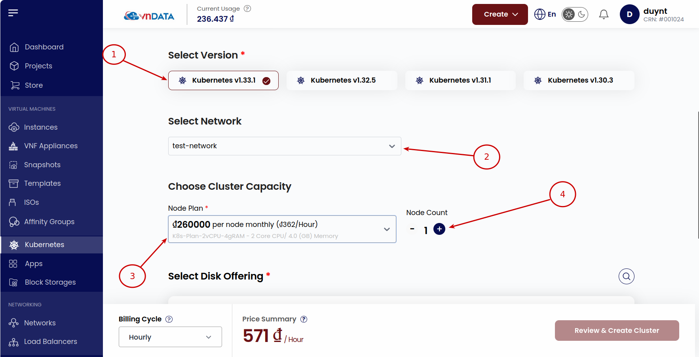
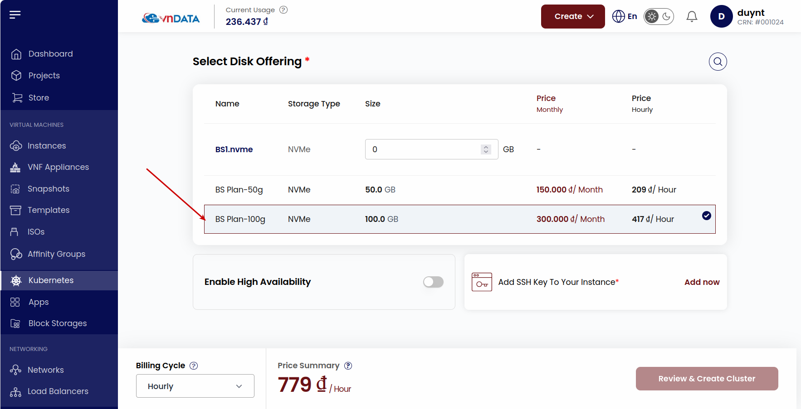
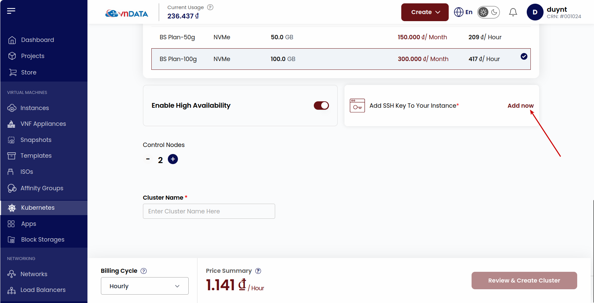
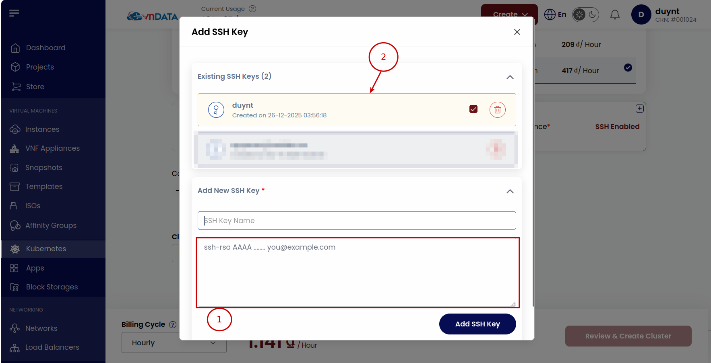
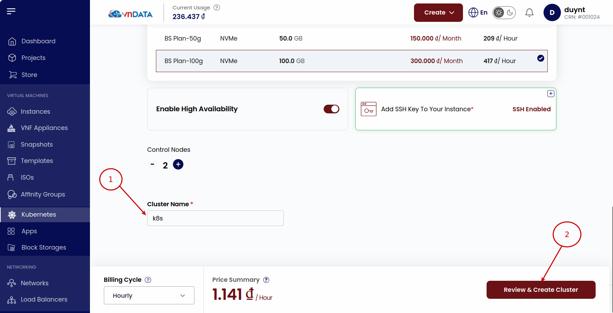

# Hướng dẫn triển khai K8s Cluster
## 1. Khởi tạo K8s Cluster
* Tại phần **Virtual Machines** -> chọn **Kubernetes** -> chọn **Create New**
  
* Chọn phiên bản **Kubernetes** tại **Select Version**, **Network** tại **Select Network**, cấu hình của mỗi node trong cluster tại **Choose Cluster Capacity** 
  
* Chọn dung lượng disk tương ứng cho từng node trong cluster
  
* Ở tùy chọn **Enable High Availability**; nếu để mặc định thì sẽ chỉ có một node dành cho control plane, còn nếu bật thì có thể thêm nhiều node hơn cho control plane
  
* Chọn **Add now** để cấu hình thêm SSH Key -> Thêm public SSH key và chọn Key tương ứng
  
  
* Điền tên tại **Cluster Name** và bấm **Review & Create Cluster**
  

## 2. Access K8s

## 3. Auto scaling

## 4. Load balancer
