# Hướng dẫn triển khai K8s Cluster
## 1. Khởi tạo K8s Cluster
* Tại phần **Virtual Machines** -> chọn **Kubernetes** -> chọn **Create New**
  
* Chọn phiên bản **Kubernetes**, Private **Network** (nếu không cần dùng chung mạng cục bộ với K8s Cluser khác thì có thể để trống phần này), cấu hình của mỗi node trong cluster tại **Choose Cluster Capacity** và số lượng worker node tại **Node Count**
  
* Chọn dung lượng disk tương ứng cho từng node trong cluster
  
* Ở tùy chọn **Enable High Availability**; nếu để mặc định thì sẽ chỉ có một node dành cho control plane, còn nếu bật thì có thể thêm nhiều node hơn cho control plane
  
* Chọn **Add now** để cấu hình thêm SSH Key -> Thêm public SSH key và chọn Key tương ứng
  
  
* Điền tên tại **Cluster Name** và bấm **Review & Create Cluster**
  

## 2. Truy cập và quản lí K8s Cluster
* Sau khi khởi tạo thành công K8s Cluster thì có thể tải config file và truy cập - quản lí thông qua CLI hoặc K8s Dashboard UI
  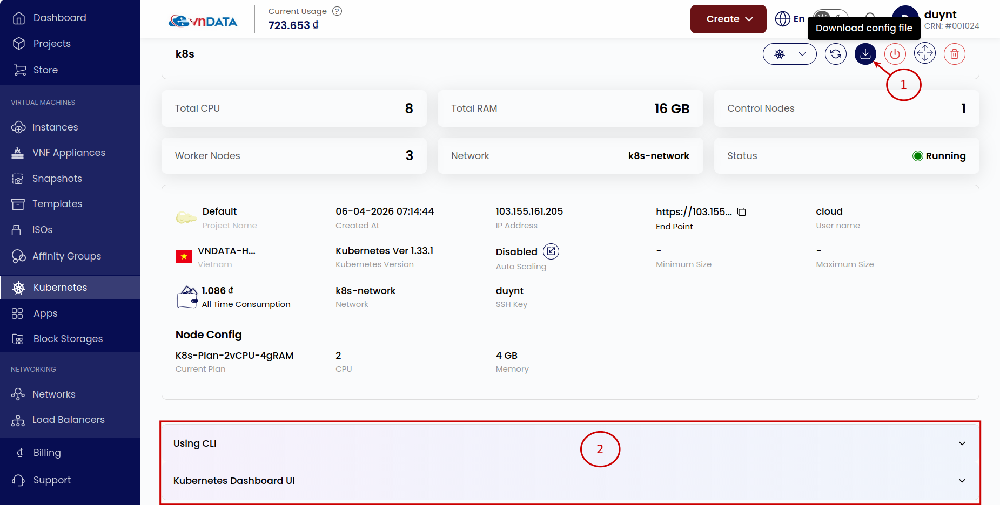
  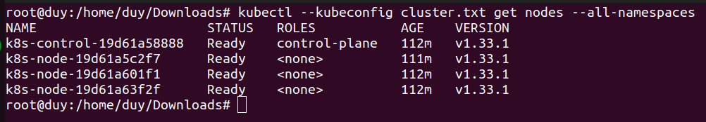
  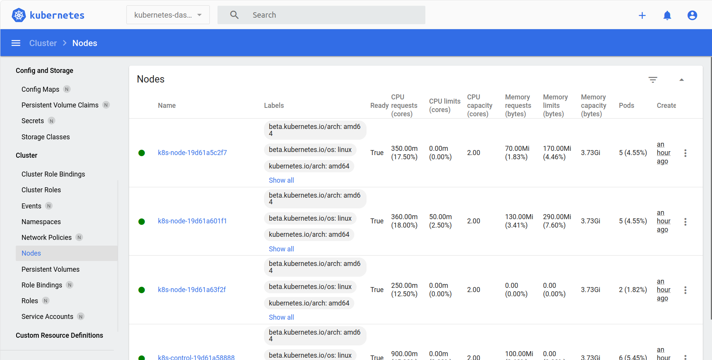
  
## 3. Auto scaling
### Kích hoạt
* Chọn biểu tượng **Scale Kubernetes Cluster**
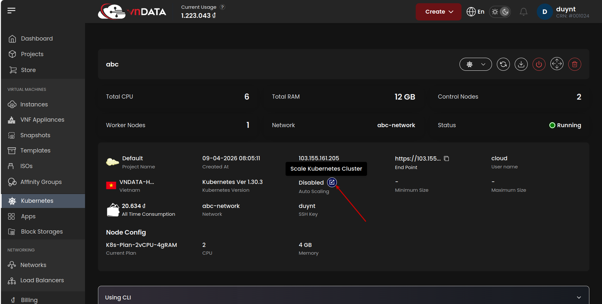
* Điền giới hạn số lượng **Worker Node** (tối thiểu, tối đa) cho cụm và bấm **Submit**
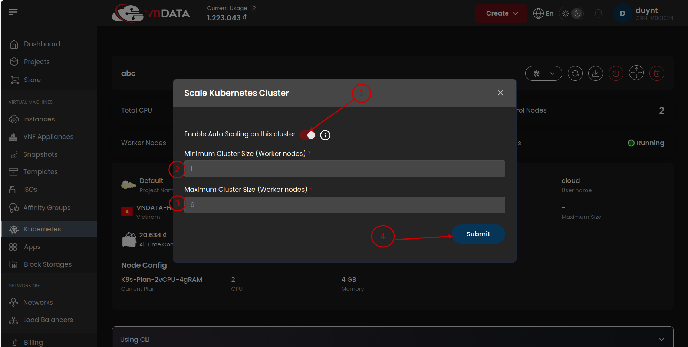
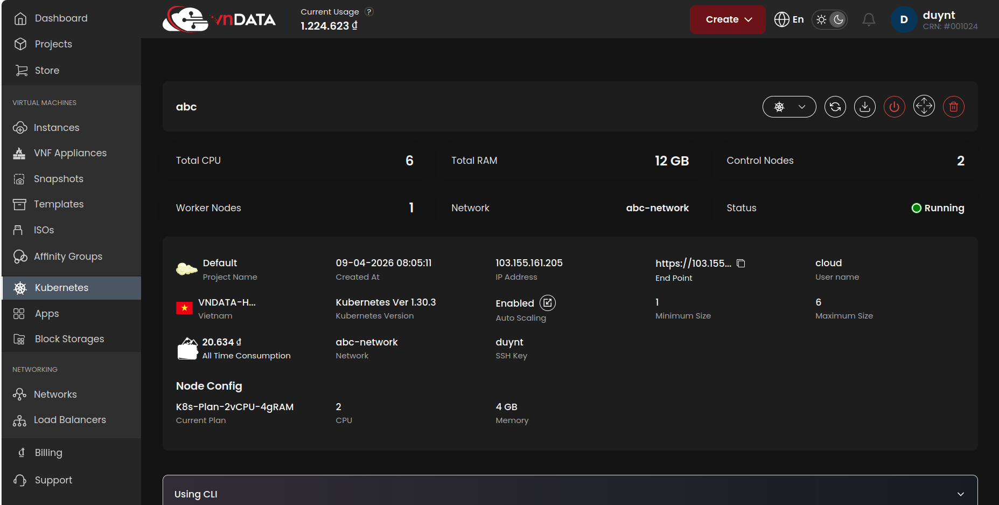

### Kiểm thử 
* Khởi tạo ứng dụng web **php-apache** để tiếp nhận các luồng truy cập
```
kubectl apply -f https://k8s.io/examples/application/php-apache.yaml
```
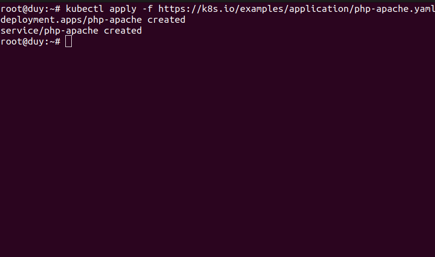
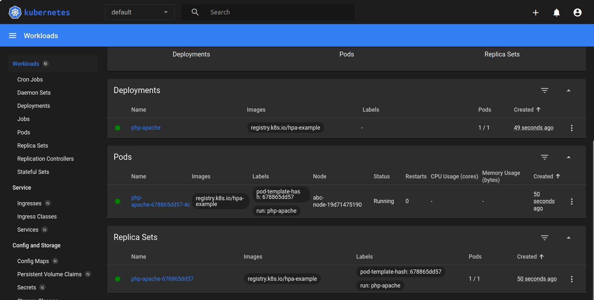
* Thiết lập định mức tài nguyên CPU tối thiểu cho mỗi pod **php-apache** là 200m
```
kubectl set resources deployment php-apache --requests=cpu=200m
```
* Thiết lập điều kiện HPA cho pod **php-apache**
```
kubectl autoscale deployment php-apache --cpu-percent=50 --min=1 --max=10
```
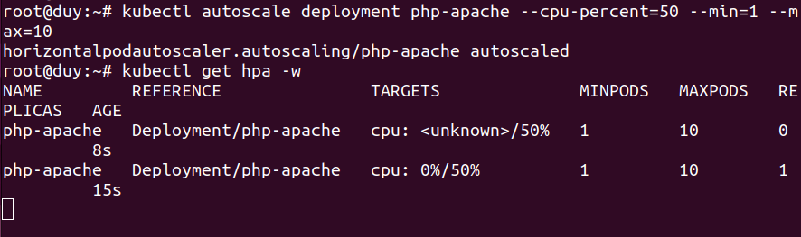
* Khởi tạo các pod **load-generator** để tạo lưu lượng đến **php-apache**
```
kubectl apply -f load-generator.yaml
```
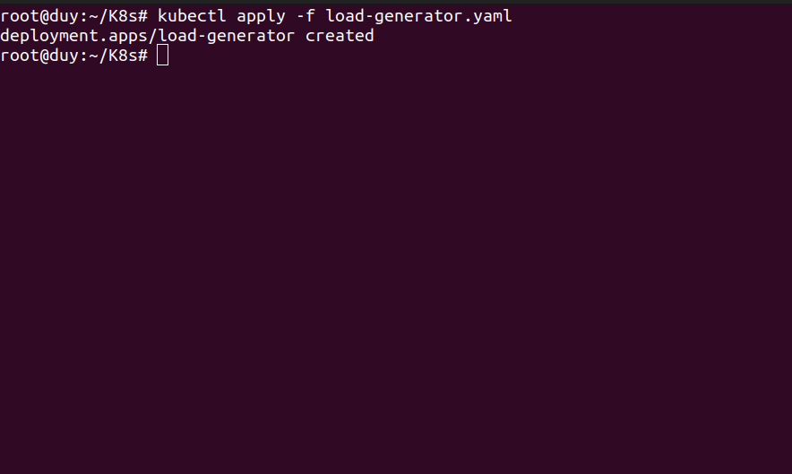
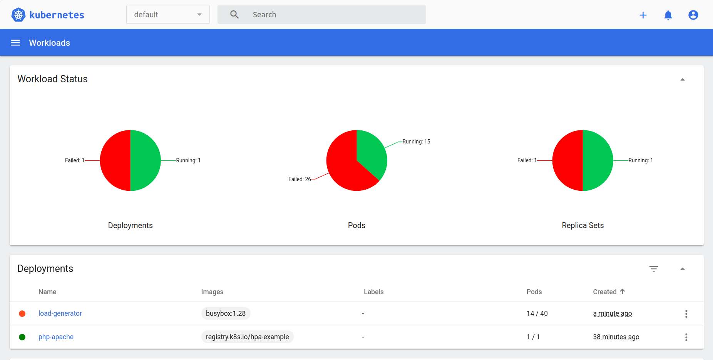
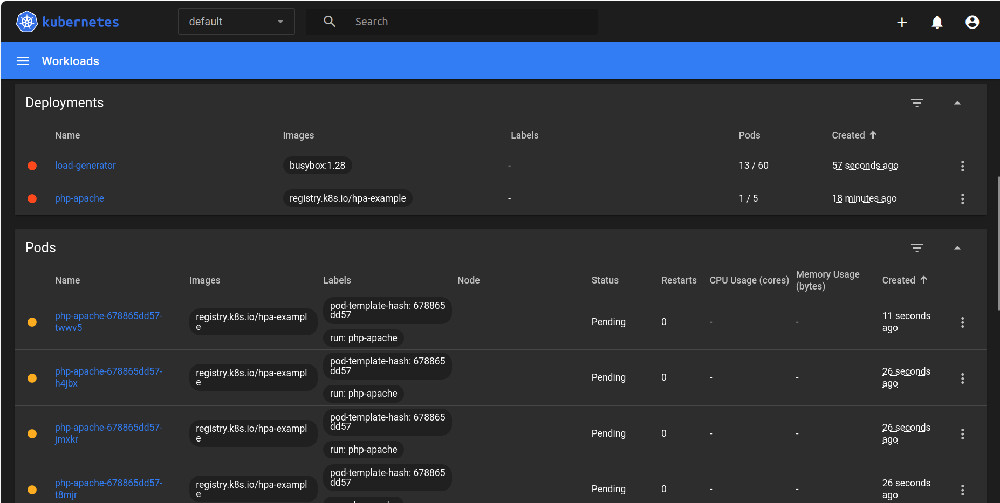
* Khi đó, tính năng **Auto Scaling** đã hoạt động để đáp ứng mức tài nguyên yêu cầu tăng cao cho các pods **php-apache**, **load-generator**
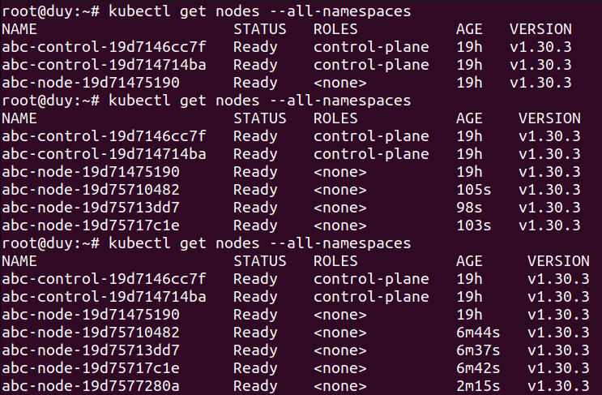 
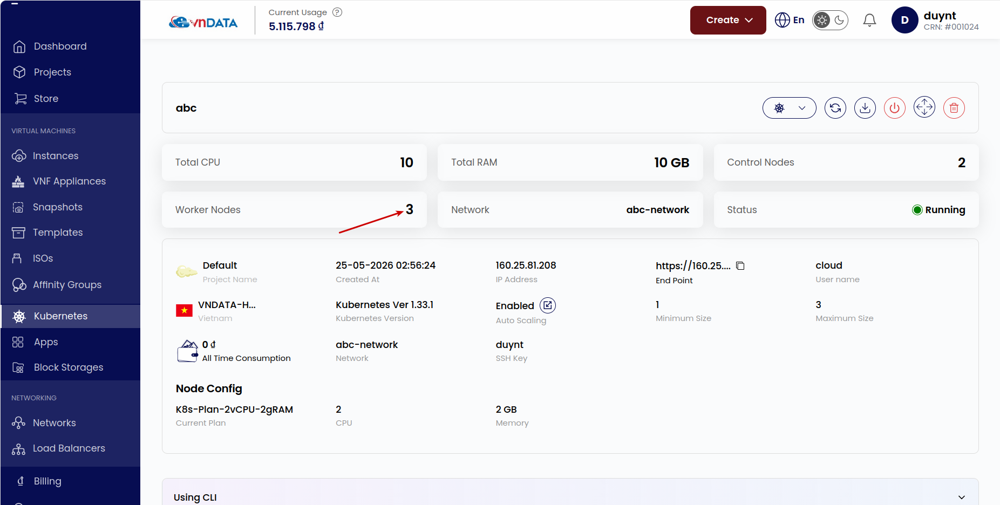
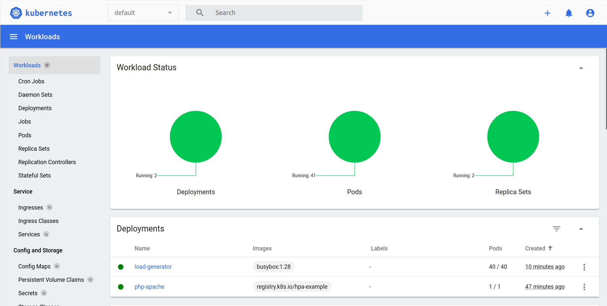
* Khi giảm lưu lượng HTTP thông qua giảm số lượng pod **load-generator** -> giảm mức yêu cầu tài nguyên từ các worker node -> **Auto Scaling** sẽ tự động xóa các worker node không cần thiết khỏi cluster
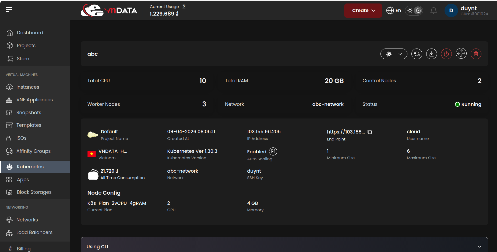
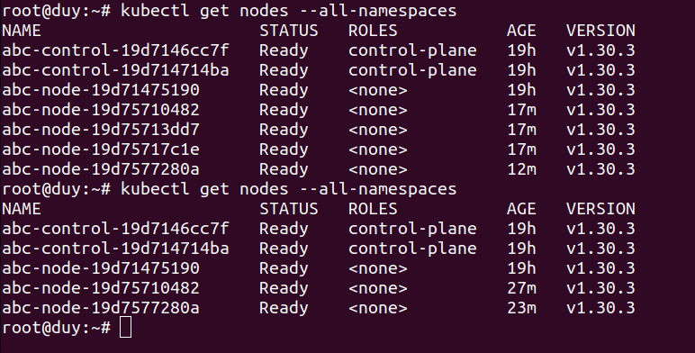

## 4. Load balancer
* Deploy Apache, Nginx
* Deploy ingress
* Demo
