# Hướng dẫn sử dụng tính năng Bucket Versioning và Lifecycle Rules

## 1. Đăng ký sử dụng gói lưu trữ dữ liệu - S3
* Nếu quý khách chưa có gói S3 thì tham khảo và đăng ký dịch vụ theo [link](https://vndata.vn/cloud-s3-object-storage-vietnam/).
  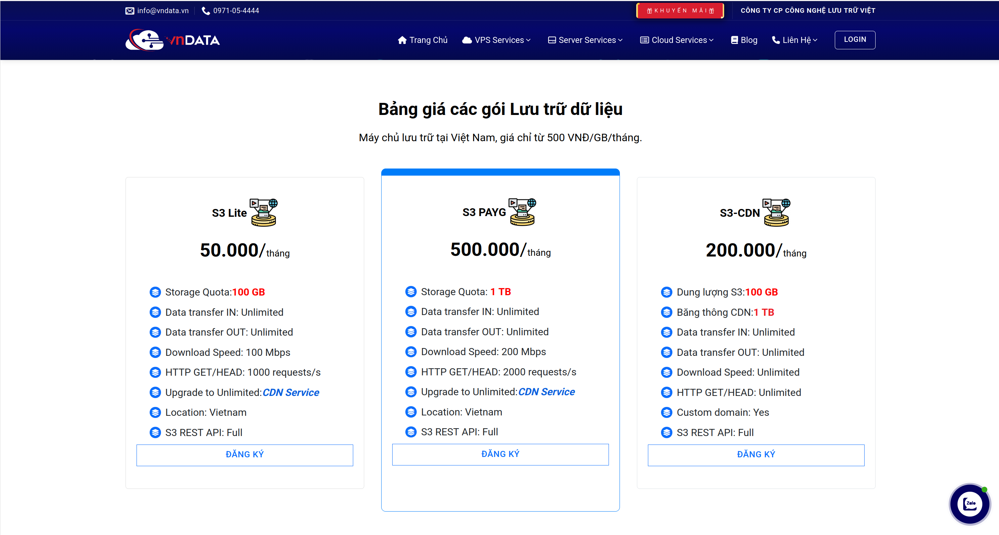

## 2. Sau khi đăng ký gói S3 thành công (Hoặc quý khách đã có gói S3)
* Truy cập vào [VNDATA S3 Portal](https://cloud.vndata.vn/) và đăng nhập tài khoản với các thông tin (Địa chỉ email/ mật khẩu) tương tự trang [VNDATA - Clients Portal](https://clients.vndata.vn/).
  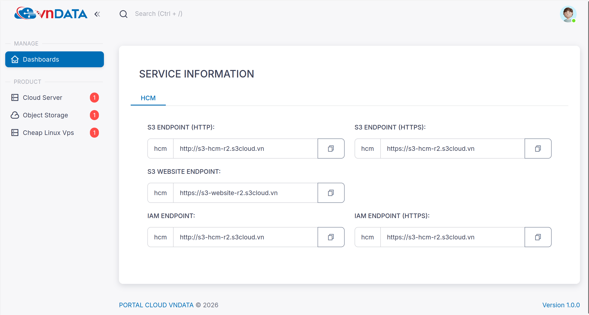
* Sau khi vào được trang S3 Portal -> click chọn **Object Storage**.
  
* Click chọn vào gói S3 tương ứng cần cấu hình **Bucket Versioning**.
  
* Chọn **Buckets** -> **Details** tại bucket cần cấu hình.
  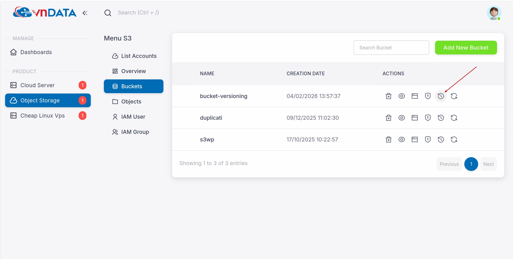
* Click nút gạt và nhấn **Submit** như trong hình để bật tính năng **Bucket Versioning**.
  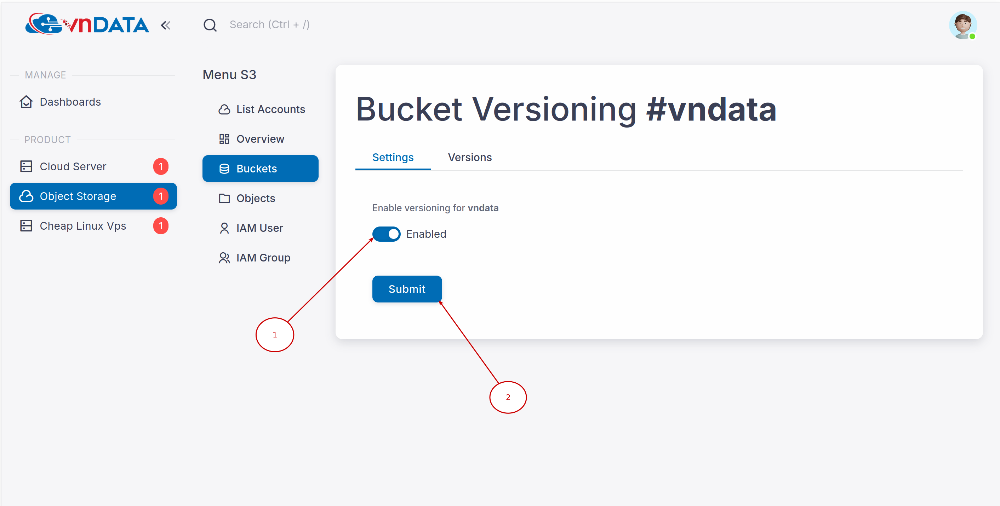
  > **Bucket Versioning** là tính năng giúp lưu giữ lại các phiên bản cũ của file để có thể khôi phục (restore) khi cần thiết, thay vì file bị mất vĩnh viễn khi upload đè hoặc xóa nhầm.
* Do bucket hiện tại chưa có dữ liệu nên phần **Versions** đang trống.
  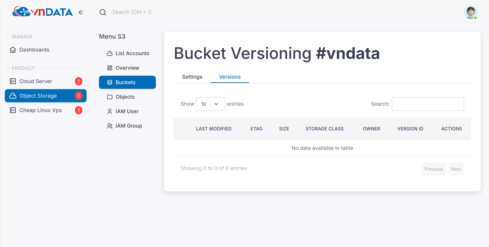
* Tiến hành upload một file text (**test.txt**) với nội dung **abcdefgh**.
  
  
* Từ máy local, sửa file **test.txt** thành nội dung **12345678** và upload lên lại chính bucket đó.
  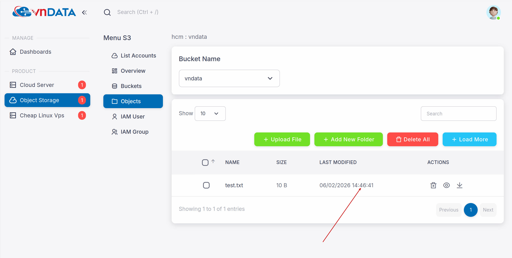
  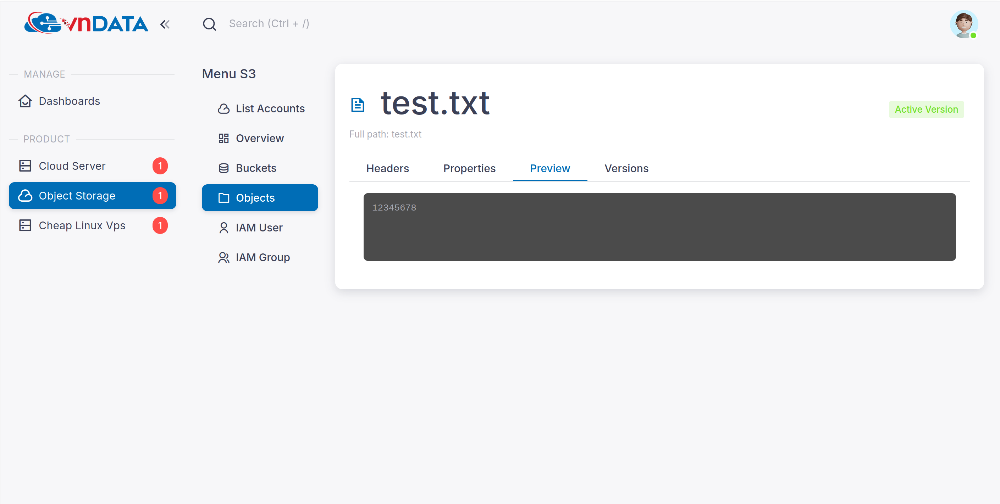
* Khi đó file **test.txt** cũ sẽ bị ẩn đi (trở thành phiên bản cũ).
  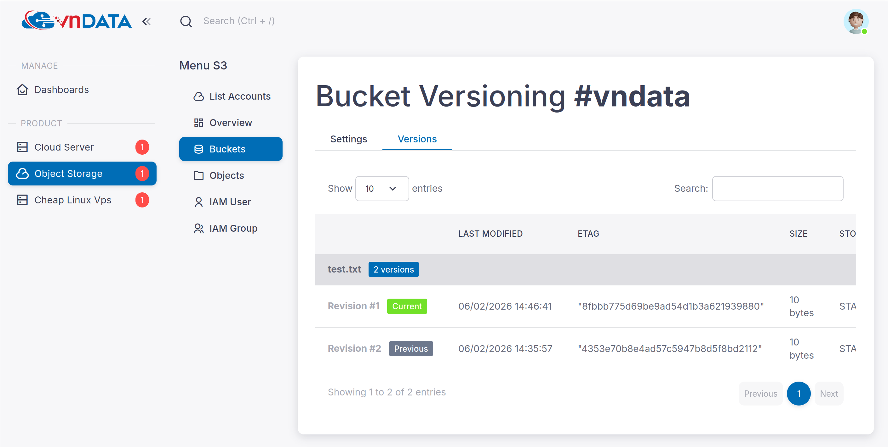
* Tại đây, ta có thể restore file **test.txt** ở bản cũ bằng cách chọn **Previous**.
  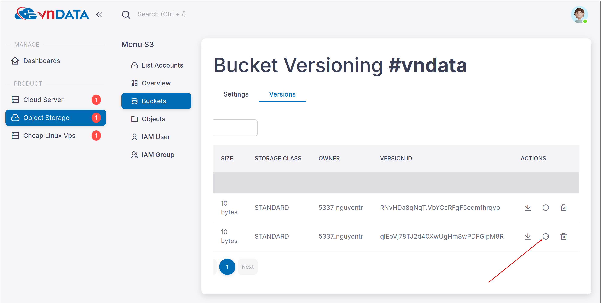
* Khi restore, hệ thống sẽ tạo ra một bản sao của chính version cũ đó và đặt thành **Current** (Hiện hành).
  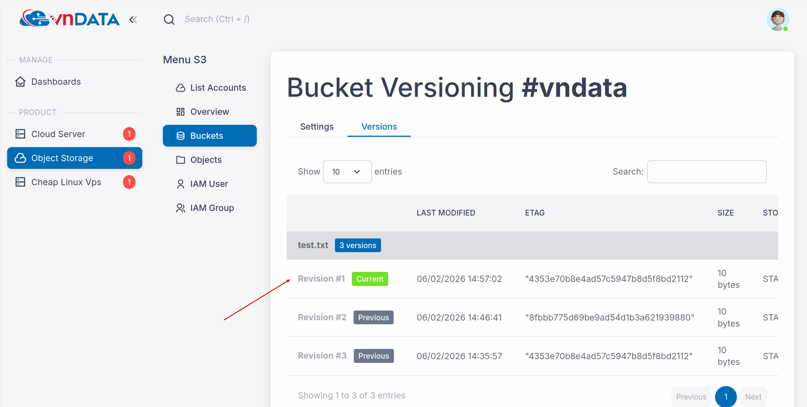
  
* Khi xóa file, hệ thống sẽ tạo một **Delete Marker** trong Versions và ẩn file khỏi giao diện **Objects**.
  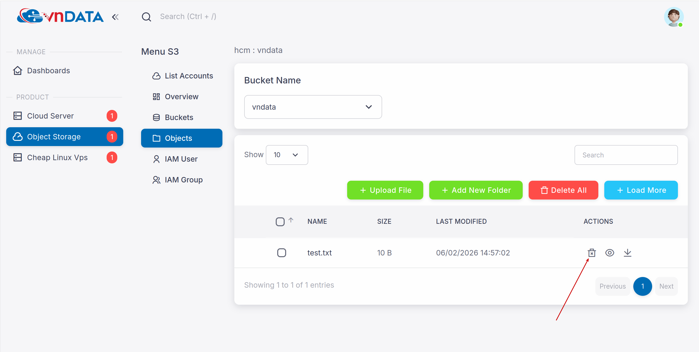
  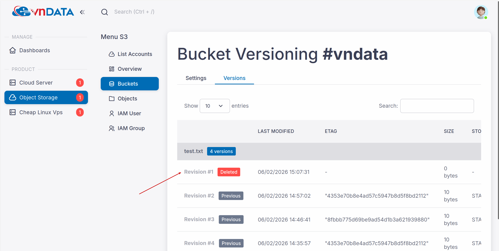
  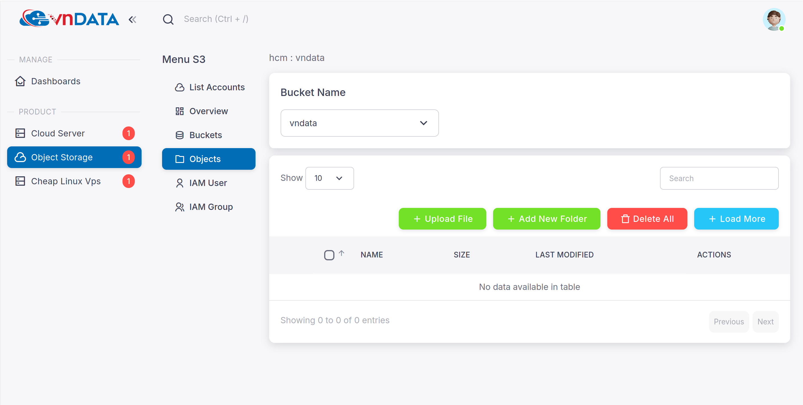

> **Lưu ý:** Việc lưu trữ mọi phiên bản của file cũng có nhược điểm. Nếu không được kiểm soát, các phiên bản cũ **(non-current versions)** sẽ tích tụ theo thời gian, chiếm dụng dung lượng bucket và làm tăng chi phí cho những dữ liệu không còn giá trị sử dụng.
>
> Để khắc phục, **Lifecycle Rule** là giải pháp giúp tự động hóa việc quản lý vòng đời của file (tự động xóa file để tối ưu chi phí).

## 3. Cấu hình Lifecycle Rules
* Để truy cập vào tính năng **Lifecycle Rule**, tại giao diện **Buckets**, click chọn **Lifecycle configuration** vào bucket cần cấu hình.
  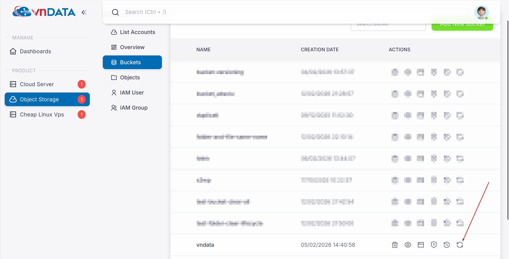
* Click chọn **Add Lifecycle Rule** để mở giao diện cấu hình.
  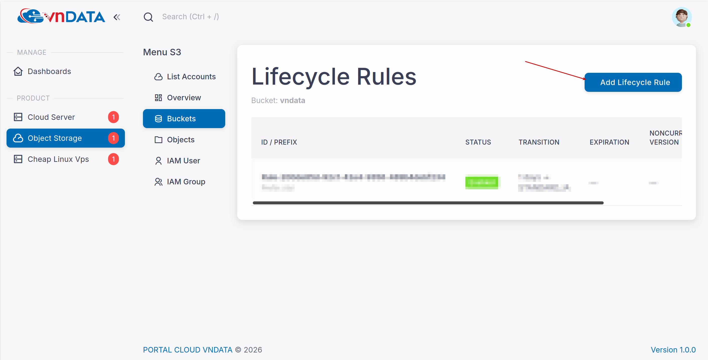
  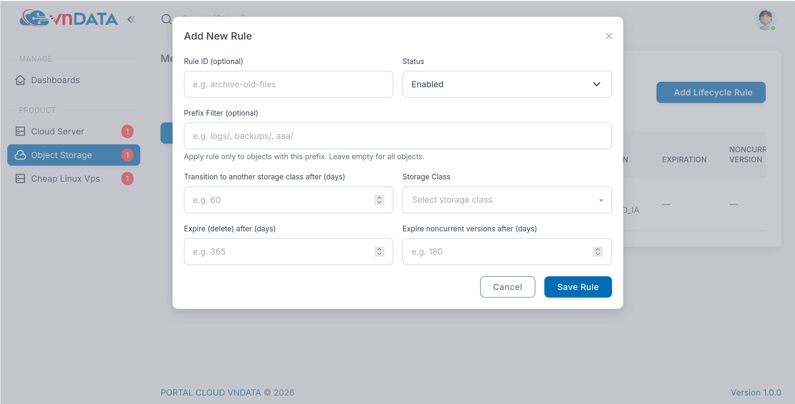

### Giải thích các thông số cấu hình:
* **Rule ID**: Điền tên gợi nhớ để dễ quản lý (hoặc để trống để hệ thống tự sinh ID).
  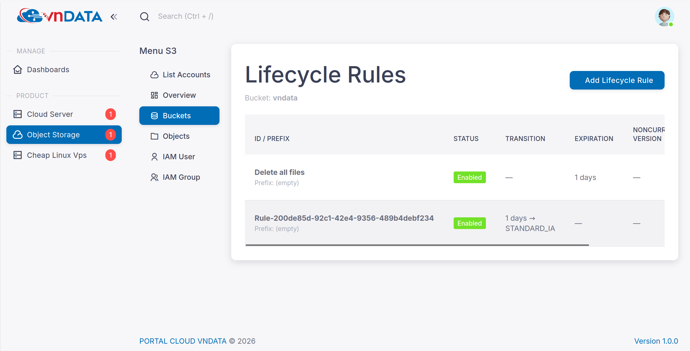
* **Status**: Chọn **Enabled** để kích hoạt hoặc **Disabled** để vô hiệu hóa rule.
* **Prefix Filter**: Trường quan trọng để định nghĩa phạm vi áp dụng của Rule (File, Thư mục hoặc Toàn bộ bucket).
  * **Các ví dụ:**
    * Áp dụng cho **tất cả dữ liệu** trong bucket: Để trống trường này.
    * Áp dụng cho thư mục **logs**: Điền `logs/` (Lưu ý có dấu `/` ở cuối).
    * Áp dụng cho thư mục con **month_backups** nằm trong thư mục **backups**: Điền `backups/month_backups/`.
    * Áp dụng cho các file/thư mục có tên **bắt đầu bằng chữ logs**: Điền `logs`.
    * Áp dụng cho đúng tên file **abc123.txt**: Điền `abc123.txt`.
* **Transition to another storage class after (days)**: Nhập số ngày để hệ thống tự động chuyển dữ liệu sang lớp lưu trữ khác.
* **Storage Class**: Chọn loại lớp lưu trữ đích (Ví dụ: `GLACIER`, `DEEP_ARCHIVE`...).
  > *Lưu ý: Tính năng này thường dùng để tương thích API với các phần mềm backup. Trên hệ thống lưu trữ của VNData, việc thay đổi Storage Class chỉ thay đổi nhãn (metadata) mà không thay đổi hiệu năng hay vị trí vật lý.*
* **Expire (delete) after (days)**: Nhập số ngày tồn tại của file hiện hành **(Current Version)**. Khi hết hạn, hệ thống sẽ gán **Delete Marker** cho file đó (file sẽ ẩn đi trong giao diện chính nhưng vẫn còn trong bucket).
* **Expire noncurrent versions after (days)**: Nhập số ngày lưu trữ các phiên bản cũ **(Noncurrent Versions)**. Thời gian bắt đầu tính từ lúc phiên bản đó trở thành cũ (do bị ghi đè bởi file mới hoặc bị xóa). Sau thời gian này, chúng sẽ bị xóa vĩnh viễn.

> **Cách tính ngày:** Hệ thống tính theo quy tắc làm tròn đến 0h UTC của ngày kế tiếp.
> *Ví dụ:* File upload vào bất kỳ giờ nào ngày **10/02** với cấu hình Expire là **3 ngày** -> Hết hạn vào cuối ngày 13/02 -> Thực thi xóa vào **0h00 ngày 14/02 (giờ UTC)**, tức **7h00 sáng ngày 14/02 (giờ Việt Nam)**.

### Các ví dụ thực tế:
* **Ví dụ 1:** Xóa file với tên file bắt đầu bằng chuỗi **Expire-delete** sau khi hết hạn 1 ngày.
  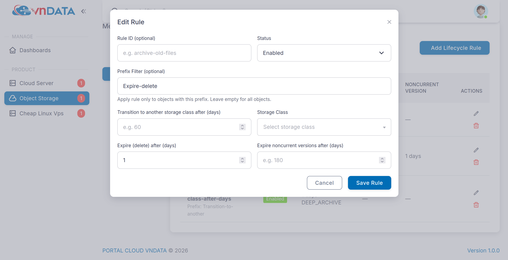
  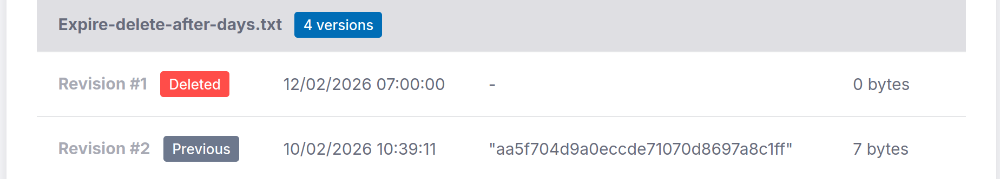
