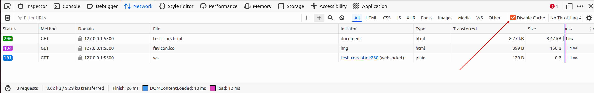

# Hướng dẫn cấu hình S3 CORS trên VNDATA Cloud Dashboard

## 1. Đăng ký sử dụng gói lưu trữ dữ liệu - S3
* Nếu quý khách chưa có gói S3, vui lòng tham khảo và đăng ký dịch vụ theo [link](https://vndata.vn/cloud-s3-object-storage-vietnam/).
  

## 2. Truy cập và cấu hình CORS
* Truy cập vào [Portal Cloud VNDATA](https://cloud.vndata.vn/) và đăng nhập bằng thông tin tài khoản (tương tự trang [VNDATA - Clients Portal](https://clients.vndata.vn/)).
  
* Sau khi đăng nhập thành công, chọn mục **Object Storage** ở thanh menu bên trái.
  
* Click chọn vào gói S3 tương ứng cần thao tác.
  
* Click vào tab **Buckets**.
  

### 2.1 CORS Default Template
* Tại bucket cần cấu hình CORS, chọn biểu tượng `...` -> **CORS Configuration** -> **Insert Default Template**.
  
  
  
* Tại đây, hệ thống hiển thị cấu hình dưới dạng JSON. Quý khách cần chú ý hai tham số quan trọng nhất là **AllowedOrigins** và **AllowedMethods**:
  * **AllowedOrigins**:
    * Là danh sách các tên miền được phép gọi vào S3 Bucket để tương tác với file (dùng các phương thức HTTP như GET, POST, PUT,...) thông qua trình duyệt.
    * **Cú pháp hợp lệ:**
      * Phải bao gồm giao thức (`http://` hoặc `https://`).
      * Phải bao gồm tên miền.
      * Có thể bao gồm port (ví dụ: `http://localhost:3000`).
      * Không được có dấu gạch chéo `/` ở cuối URL. (Ví dụ: **đúng**: `https://vndata.vn`, **sai**: `https://vndata.vn/`).
    * **Ngoại lệ & Ký tự đại diện (Wildcard):**
      * **Dấu `*` (Cho phép tất cả):** Khi điền là `["*"]`, bất kỳ website nào cũng có thể gọi API tới file nằm trong bucket.
      * **Dấu `*` làm tiền tố:** Có thể dùng `*` để đại diện cho tất cả subdomain. Ví dụ: `https://*.vndata.vn` sẽ cho phép cả `app.vndata.vn` và `api.vndata.vn` (Lưu ý: Chỉ cho phép 1 dấu `*` trong chuỗi).
  * **AllowedMethods**:
    * Khi website đã được cấp phép ở `AllowedOrigins`, thì `AllowedMethods` sẽ quy định các phương thức HTTP mà website đó được phép thực thi lên các file trong Bucket S3.
    * Bao gồm các phương thức như: **GET, HEAD, PUT, POST, DELETE**.

### 2.2 Ví dụ
* **Trường hợp 1: Đối với AllowedMethods**
  * Cấu hình CORS ban đầu: Chỉ cho phép HTTP **GET** đối với các file trong bucket `vndata02`.
    
    
  * Dùng tính năng [**Presigned URL**](https://wiki.vndata.vn/s3-object-storage/huong-dan-su-dung/s3-presigned-url/) để tạo URL với HTTP method là **GET** cho file `s3_test.txt`.
  * Tiến hành kiểm thử, yêu cầu thực thi thành công.
    
  * Tiếp theo, tạo Presigned URL với HTTP method là **DELETE** cho file `s3_test.txt` và kiểm thử.
    
    > **Lưu ý:** Do ở bước cấu hình CORS chưa cấp quyền cho phương thức DELETE, trình duyệt sẽ chặn và báo lỗi khi gửi request này.
  * Sau khi bổ sung thêm phương thức `"DELETE"` vào cấu hình CORS, yêu cầu xóa file đã thực thi thành công.
    
    

* **Trường hợp 2: Đối với AllowedOrigins**
  * Chỉnh cấu hình **AllowedOrigins** chỉ chấp nhận duy nhất tên miền `https://vndata.vn`. Khi thực thi lệnh HTTP GET từ một tên miền khác (ví dụ: localhost), trình duyệt sẽ xuất hiện lỗi chặn CORS như hình.
    
    
  * Sau khi cấu hình lại đúng Origin đang gọi, request GET đã thực thi thành công.
    
    

> **Lưu ý:** Trong quá trình thao tác, quý khách nên tick chọn ô **Disable Cache** trong tab Network của DevTools (F12) để tránh việc trình duyệt sử dụng lại kết quả kiểm duyệt CORS cũ, giúp việc kiểm thử chính xác hơn.
  

