# Hướng dẫn cấu hình S3 CORS trên VNDATA Cloud Dashboard

## 1. Đăng ký sử dụng gói lưu trữ dữ liệu - S3
* Nếu quý khách chưa có gói S3, vui lòng tham khảo và đăng ký dịch vụ theo [link](https://vndata.vn/cloud-s3-object-storage-vietnam/).
  

## 2. Truy cập và cấu hình CORS
* Truy cập vào [Portal Cloud VNDATA](https://cloud.vndata.vn/) và đăng nhập bằng thông tin tài khoản (tương tự trang [VNDATA - Clients Portal](https://clients.vndata.vn/)).
  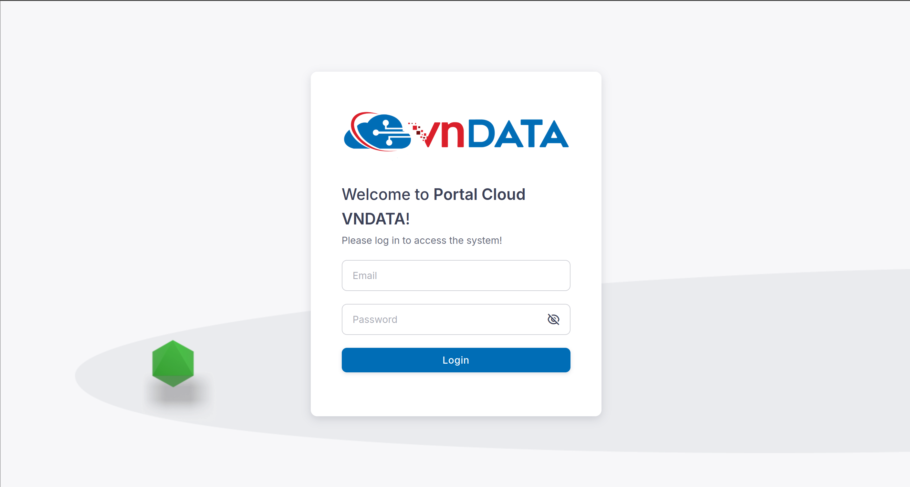
* Sau khi đăng nhập thành công, chọn mục **Object Storage** ở thanh menu bên trái.
  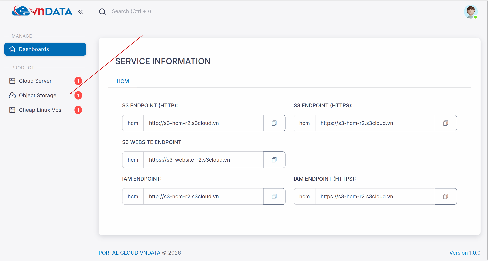
* Click chọn vào gói S3 tương ứng cần thao tác.
  
* Click vào tab **Buckets**.
  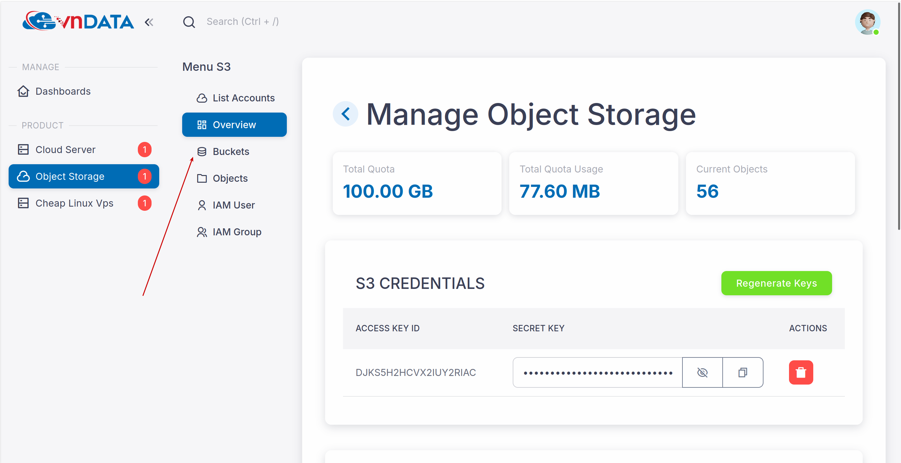

### 2.1 CORS Default Template
* Tại bucket cần cấu hình CORS, chọn `...` -> **CORS Configuration** -> **Insert Default Template**
  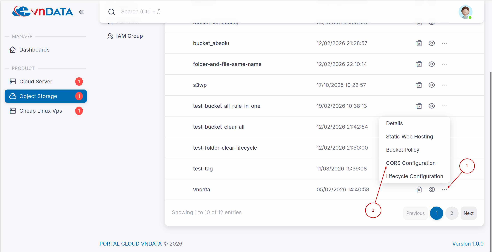
  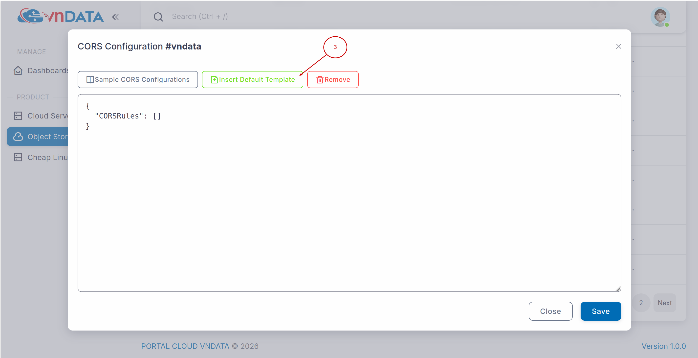
  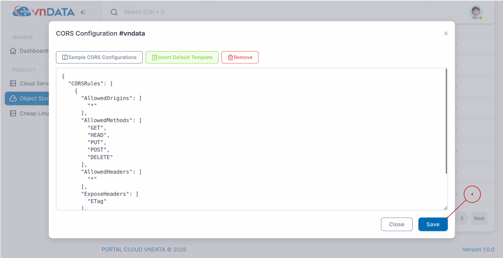
* Tại đây, ta cần chú ý hai phần là **AllowedOrigins** và **AllowedMethods**:
  * **AllowedOrigins**:
    * Là danh sách các tên miền được phép gọi vào S3 Bucket để tương tác với file (dùng các giao thức HTTP như GET, POST, PUT,...) thông qua trình duyệt.
    * Cú pháp hợp lệ:
      * Phải bao gồm giao thức (`http://` hoặc `https://`).
      * Phải bao gồm tên miền.
      * Có thể bao gồm port (ví dụ: http://localhost:3000)
      * Không được có dấu gạch chéo `/` ở cuối URL. (Ví dụ: **đúng**: `https://vndata.vn`, **sai**: `https://vndata.vn/`)
    * Ngoại lệ & Ký tự đại diện (Wildcard):
      * Dấu `*` (Cho phép tất cả): Khi điền là `["*"]`, bất kỳ website nào cũng có thể gọi API tới file nằm trong bucket.
      * Dấu `*` làm tiền tố: Có thể dùng `*` để đại diện cho tất cả subdomain. Ví dụ: `https://*.vndata.vn` sẽ cho phép cả `app.vndata.vn` và `api.vndata.vn`.(Lưu ý: Chỉ cho phép 1 dấu `*` trong chuỗi).
  * **AllowedMethods**:
    * Khi website đã được cấp phép ở `AllowedOrigins`, thì `AllowedMethods` sẽ quy định các giao thức HTTP mà các website đó được thực thi lên các file trong Bucket S3.
    * Bao gồm các giao thức như: **GET, HEAD, PUT, POST, DELETE**.

### 2.2 Ví dụ
* **Đối với AllowedMethods**
  * Cấu hình CORS - HTTP GET cho các file trong bucket vndata02 như trong ảnh
    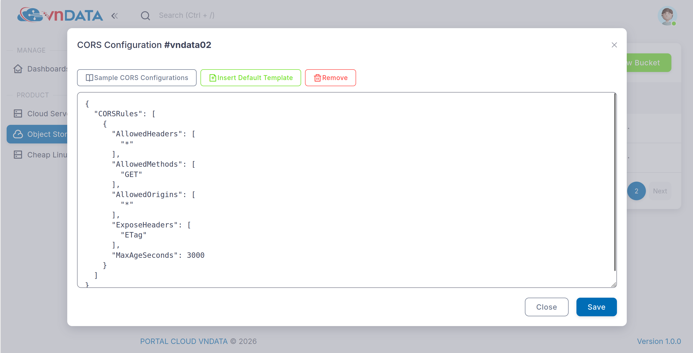
    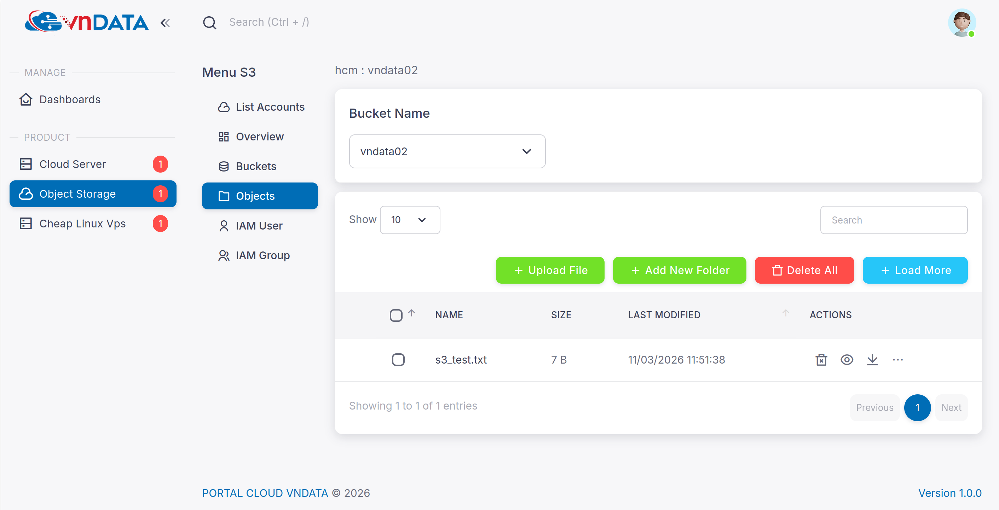
  * Dùng tính năng [**Presigned URL**]() để generate URL với HTTP method là GET cho file **s3_test.txt**
  * Tiến hành kiểm thử
    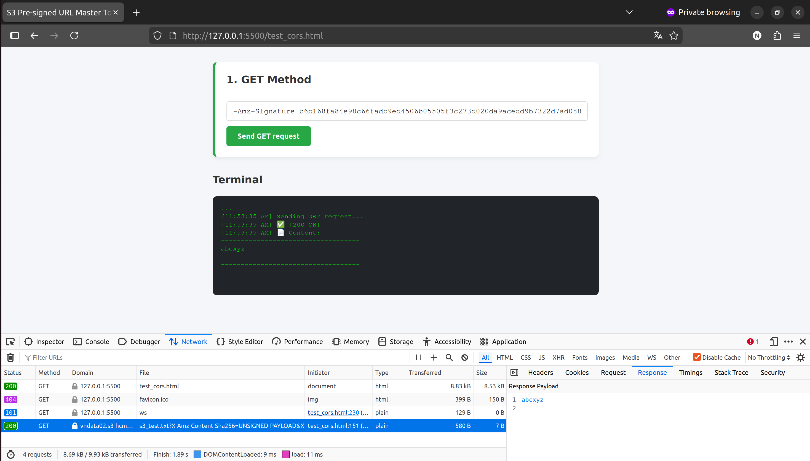
  * Tiếp theo, sẽ generate Presigned URL với HTTP method là DELETE cho file **s3_test.txt** và kiểm thử
    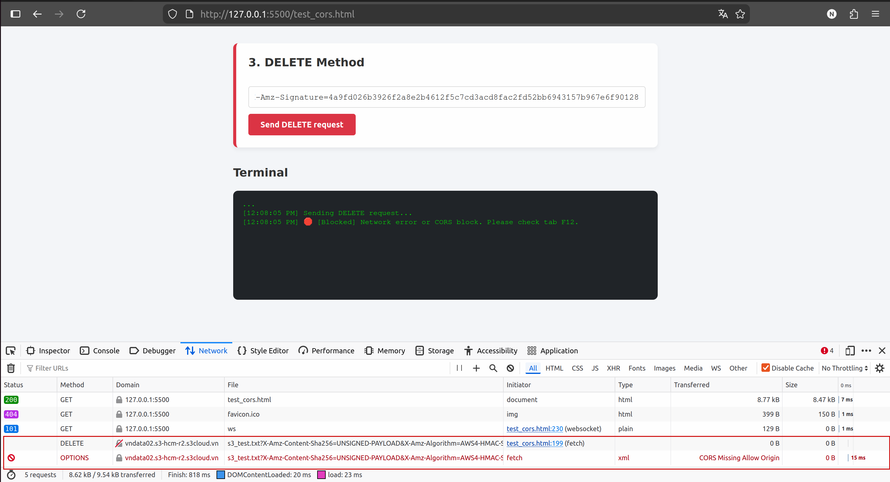
    > Tại vì ở bước cấu hình CORS chưa thêm method DELETE nên sẽ báo lỗi khi gửi request HTTP DELETE
  * Sau khi thêm bổ sung thêm cấu hình CORS thì hiện đã xóa được file
    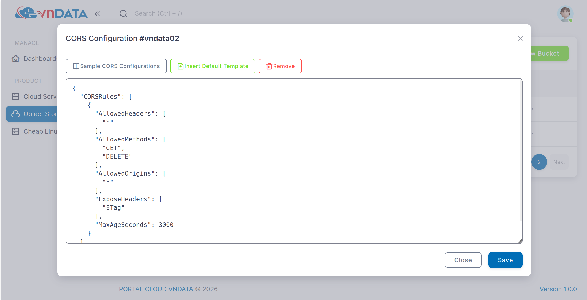
    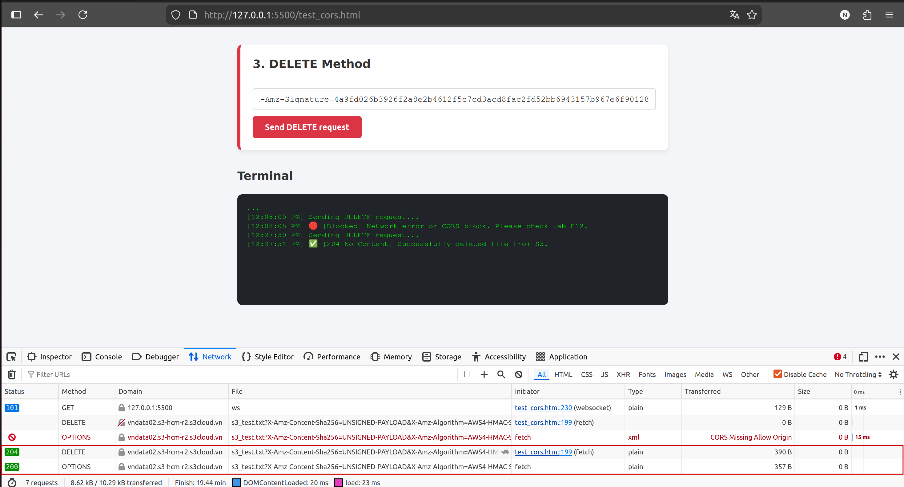

* **Đối với AllowedOrigins**
  * Chỉnh cấu hình **AllowedOrigins** chỉ chấp nhận mỗi tên miền **https://vndata.vn**, thực thi lệnh HTTP GET và xuất hiện lỗi như hình
    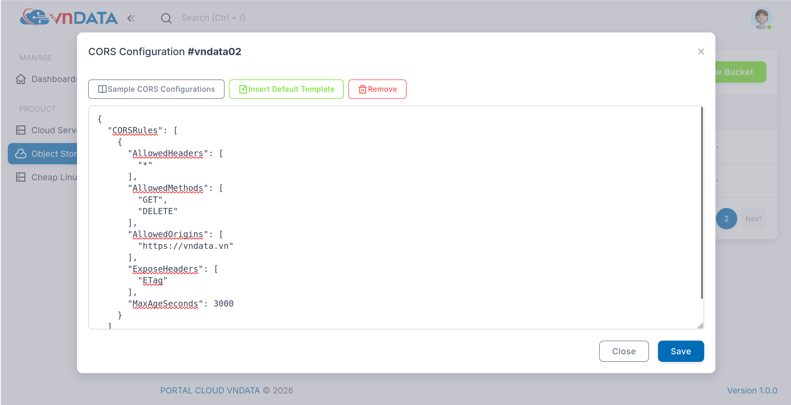
    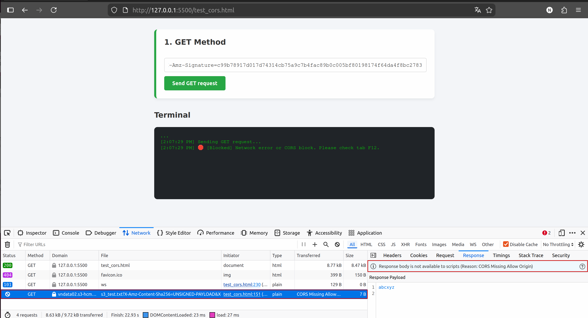
  * Sau khi allow đúng origin thì đã thực thi request GET được
    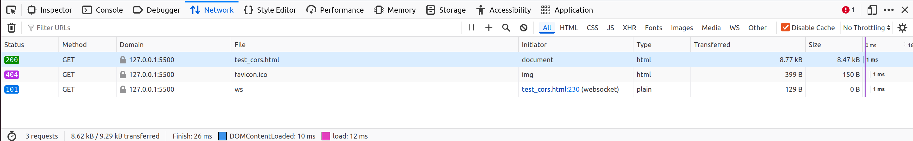
    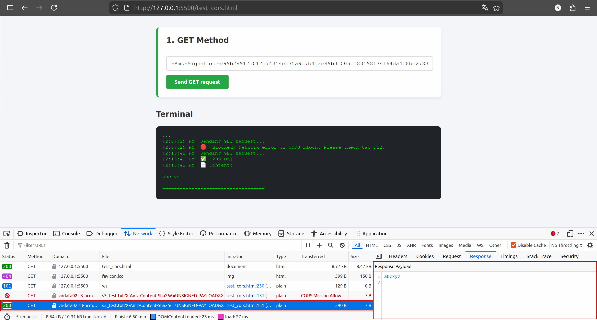

