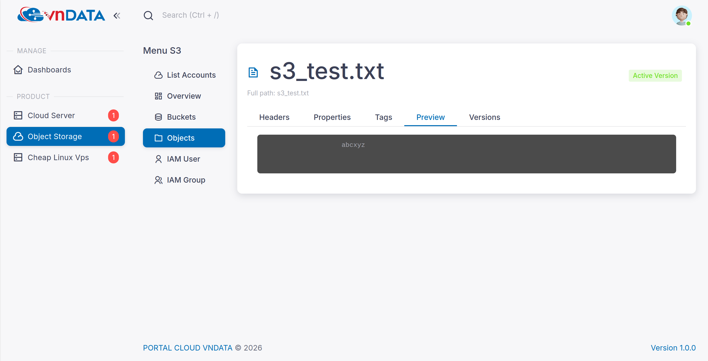
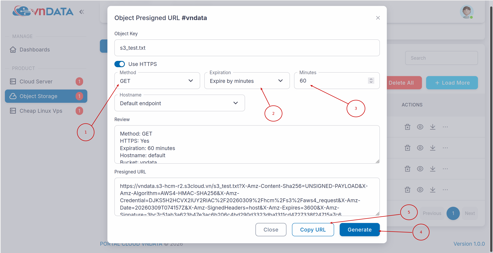
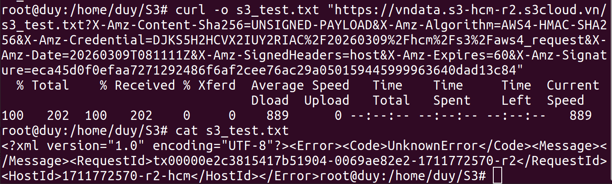
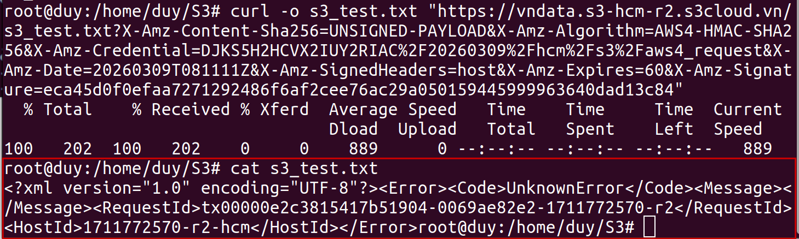
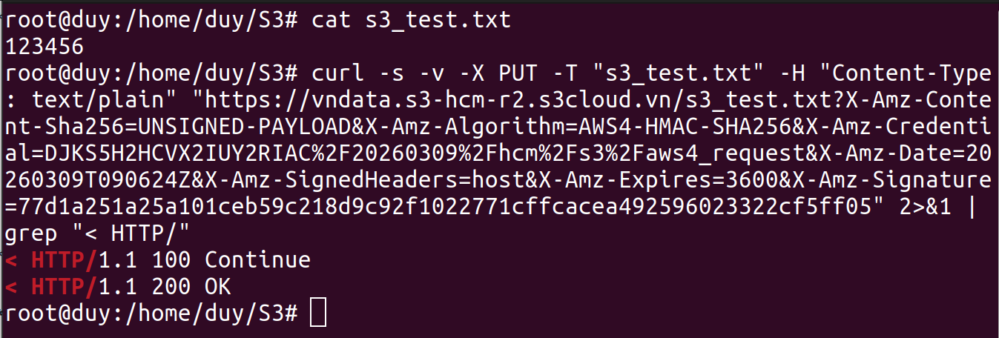
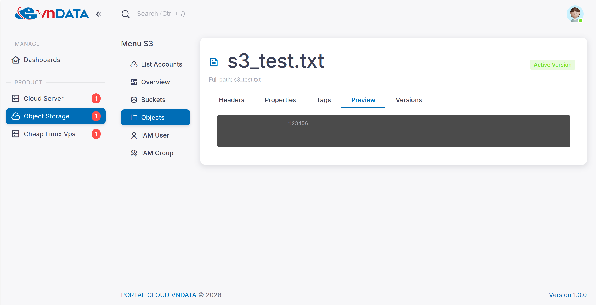
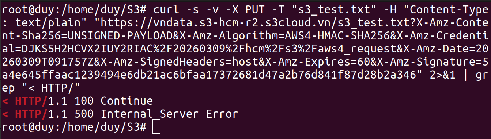

# Hướng dẫn sử dụng tính năng Pre-signed URL

## 1. Đăng ký sử dụng gói lưu trữ dữ liệu - S3
* Nếu quý khách chưa có gói S3 thì tham khảo và đăng ký dịch vụ theo [link](https://vndata.vn/cloud-s3-object-storage-vietnam/).
  

## 2. Sau khi đăng ký gói S3 thành công (Hoặc quý khách đã có gói S3)
* Truy cập vào [VNDATA S3 Portal](https://cloud.vndata.vn/) và đăng nhập tài khoản với các thông tin (Địa chỉ email/ mật khẩu) tương tự trang [VNDATA - Clients Portal](https://clients.vndata.vn/).
  
* Sau khi vào được trang S3 Portal -> click chọn **Object Storage**.
  
* Click chọn vào gói S3 tương ứng cần cấu hình **Pre-signed URL**.
  
* Click chọn vào bucket chứa các object cần cấu hình **Pre-signed URL**.
  
* Trong bucket đã upload sẵn file **s3_test.txt** với nội dung **abcxyz**
  
  
* Click chọn dấu ba chấm -> **Presign URL**
  
* Tại đây, ta sẽ cần chú ý ở hai phần là **Method** và **Expiration**
  * **Method**: bao gồm ba phương thức HTTP là **GET**, **PUT**, **DELETE**
  * **Expiration**: bao gồm **No expiration (max 7d)**, **Expire by minutes**, **Expire by days**
    > Tại mục **Expiration**, ở 3 tùy chọn trên đều chỉ có thời gian quy đổi tối đa là 7 ngày
  
  

## 3. Ví dụ thực tế
* **Ví dụ 01**: Thiết đặt **Presigned URL** với **HTTP GET** áp dụng trên object **s3_test.txt**
  
  * Các bước thao tác:
    * Ở phần **method** chọn **GET**, **Expiration** là 60 phút
    * Bấm chọn **Generate** -> click **Copy URL**
    * Kiểm thử **HTTP GET** qua lệnh
      ```
      curl -o s3_test.txt "Presigned_URL_HTTP_GET_đã_generate_ở_bước_trên"
      ```
      
  * Nếu **Presigned URL** đã hết hạn thì sẽ trả về file với kết quả lỗi như ảnh sau:
     
* **Ví dụ 02**: Thiết đặt **Presigned URL** với **HTTP PUT** áp dụng trên object **s3_test.txt**
  * Các bước khởi tạo **Presigned URL** với **HTTP PUT** tương tự như ở **Ví dụ 01**
  * Ở ví dụ này, sẽ điều chỉnh file **s3_test.txt** tại local lại với nội dung **123456** và **PUT** lại file s3_test.txt lên Bucket với lệnh sau
    ```
    curl -s -v -X PUT -T "s3_test.txt" -H "Content-Type: text/plain" "Presigned_URL_HTTP_PUT_đã_generate_ở_bước_trên" 2>&1 | grep "< HTTP/"
    ```
    
    
    > Khi đó, file **s3_test.txt** cũ sẽ bị thay thế thành file **s3_test.txt** mới với nội dung **123456**
  * Nếu **Presigned URL** đã hết hạn thì sẽ trả về file với kết quả lỗi như ảnh sau:
    
* **Ví dụ 03**: Thiết đặt **Presigned URL** với **HTTP DELETE** áp dụng trên object **s3_test.txt**
  * Các bước khởi tạo **Presigned URL** với **HTTP DELETE** tương tự như ở các ví dụ trên
  * Thực thi lệnh sau để xóa file **s3_test.txt** khỏi bucket
    ```
    curl -s -v -X DELETE "Presigned_URL_HTTP_DELETE_đã_generate_ở_bước_trên" 2>&1 | grep "< HTTP/"
    ```
    
  * Nếu **Presigned URL** đã hết hạn thì sẽ trả về file với kết quả lỗi như ảnh sau:
    
    
