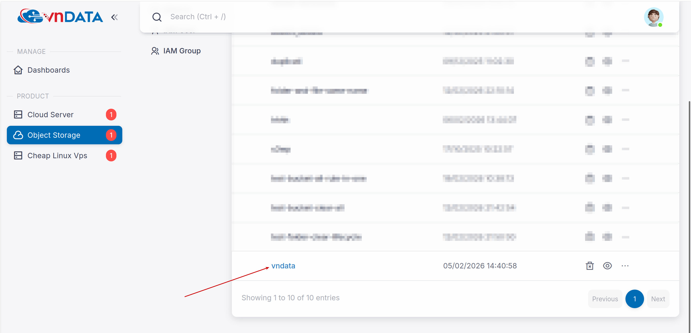
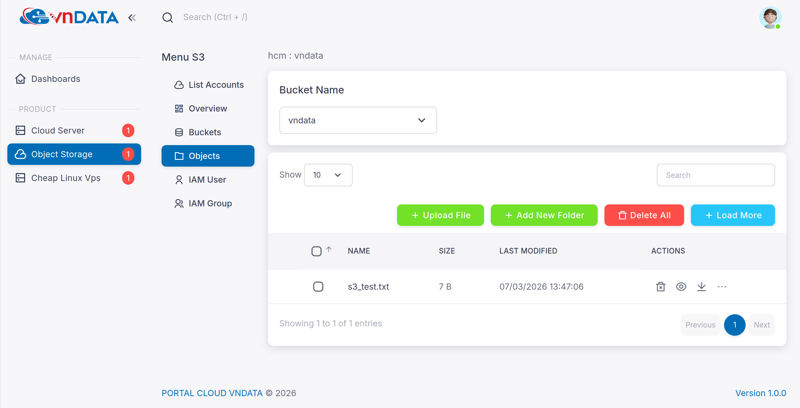
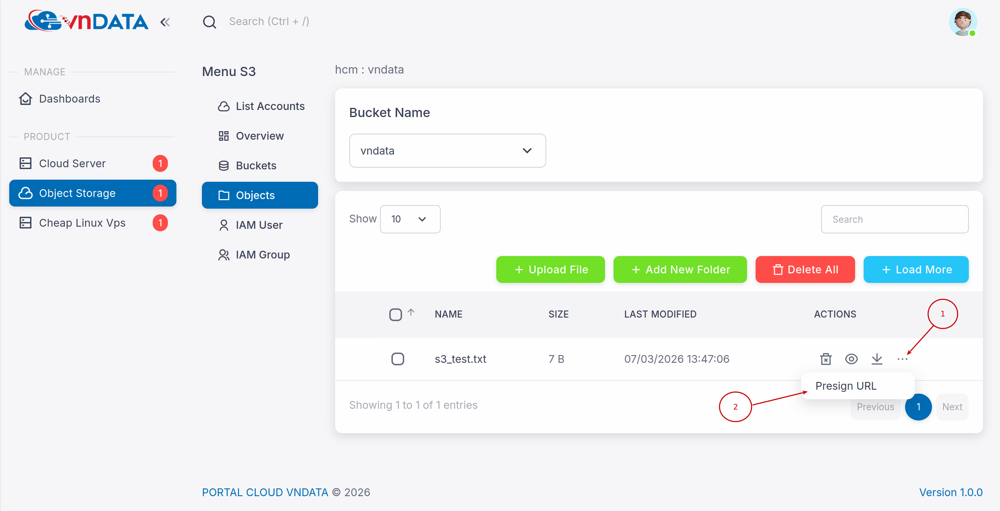
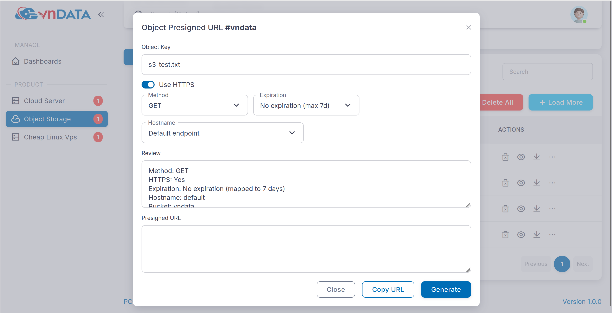
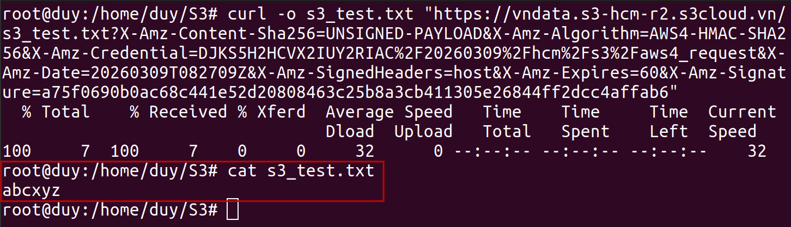
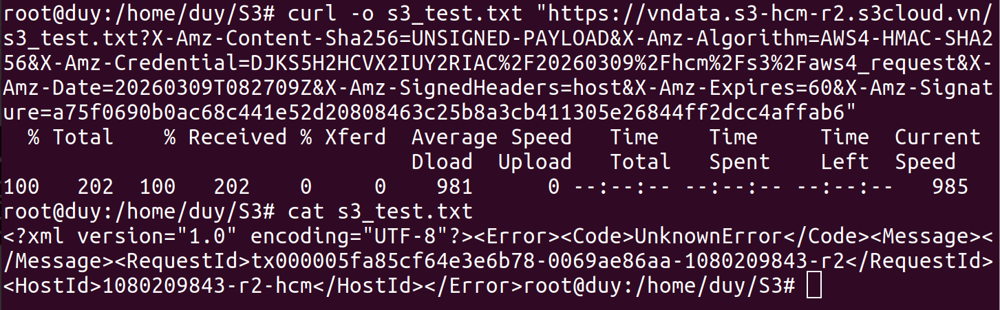
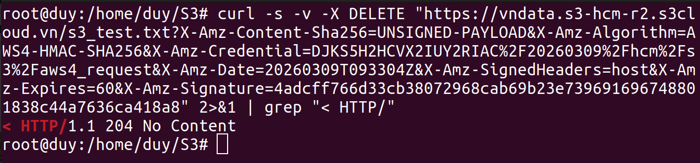
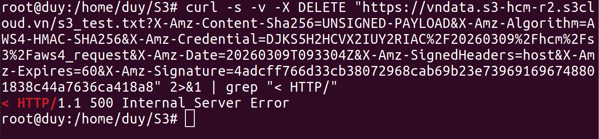

# Hướng dẫn sử dụng tính năng Presigned URL

## 1. Đăng ký sử dụng gói lưu trữ dữ liệu - S3
* Nếu quý khách chưa có gói S3, vui lòng tham khảo và đăng ký dịch vụ theo [link](https://vndata.vn/cloud-s3-object-storage-vietnam/).
  

## 2. Truy cập và khởi tạo Presigned URL
* Truy cập vào [VNDATA S3 Portal](https://cloud.vndata.vn/) và đăng nhập bằng thông tin tài khoản tương tự trang [VNDATA - Clients Portal](https://clients.vndata.vn/).
  
* Sau khi đăng nhập thành công, chọn mục **Object Storage** ở thanh menu bên trái.
  
* Click chọn vào gói S3 tương ứng cần thao tác.
  
* Mở Bucket chứa các Object (file) cần tạo **Presign URL**.
  
* *(Ví dụ: Trong bucket đã upload sẵn file **s3_test.txt** với nội dung là **abcxyz**)*.
  
  
* Tại dòng chứa file, click chọn biểu tượng dấu ba chấm (`...`) -> Chọn **Presign URL**.
  
* Tại giao diện khởi tạo, quý khách cần lưu ý 2 thông số quan trọng:
  * **Method (Phương thức):** Bao gồm 3 tùy chọn HTTP là **GET** (Tải về), **PUT** (Tải lên/Ghi đè), **DELETE** (Xóa file).
  * **Expiration (Thời gian hết hạn):** Cho phép thiết lập thời gian URL có hiệu lực (Tính theo phút hoặc ngày).
    > **Lưu ý:** Theo chuẩn hệ thống S3, thời gian sống tối đa của một Presigned URL luôn bị giới hạn ở mức **7 ngày**. Hệ thống không hỗ trợ tạo đường link tồn tại vĩnh viễn.
  
  

## 3. Ví dụ thực tế

### Ví dụ 01: Thiết đặt Presigned URL với HTTP GET (Tải file)
* **Mục đích:** Cấp quyền tải file `s3_test.txt` về máy tính cục bộ (Local).
  
* **Các bước thực hiện:**
  * Ở phần **Method** chọn **GET**, **Expiration** thiết lập là 60 phút.
  * Bấm chọn **Generate** -> click **Copy URL**.
  * Mở Terminal và kiểm thử tính năng qua lệnh `curl`:
    ```bash
    curl -o s3_test.txt "<Dán_URL_đã_Copy_vào_đây>"
    ```
    
* **Kiểm tra Timeout:** Nếu gọi lệnh khi URL đã hết hạn, hệ thống sẽ từ chối truy cập và trả về thông báo lỗi như ảnh chi tiết dưới đây:
   

### Ví dụ 02: Thiết đặt Presigned URL với HTTP PUT (Cập nhật file)
* **Mục đích:** Cho phép ghi đè nội dung mới lên file `s3_test.txt` thông qua URL.
* **Các bước thực hiện:**
  * Khởi tạo URL tương tự Ví dụ 01, nhưng đổi **Method** thành **PUT**.
  * Tại máy tính Local, tạo/sửa một file `s3_test.txt` với nội dung mới là **123456**.
  * Dùng lệnh `curl` sau để đẩy file lên S3 (Lưu ý phải có tham số `-H "Content-Type: text/plain"` để file hiển thị đúng định dạng trên UI):
    ```bash
    curl -s -v -X PUT -T "s3_test.txt" -H "Content-Type: text/plain" "<Dán_URL_đã_Copy_vào_đây>" 2>&1 | grep "< HTTP/"
    ```
    
    
    > Lúc này, file `s3_test.txt` cũ trên hệ thống S3 đã bị thay thế thành file mới với nội dung là **123456**.
* **Kiểm tra Timeout:** Tương tự, nếu sử dụng URL quá hạn để upload, hệ thống sẽ báo lỗi:
  

### Ví dụ 03: Thiết đặt Presigned URL với HTTP DELETE (Xóa file)
* **Mục đích:** Cho phép xóa file `s3_test.txt` khỏi bucket mà không cần đăng nhập giao diện.
* **Các bước thực hiện:**
  * Khởi tạo URL với **Method** là **DELETE**.
  * Thực thi lệnh sau để gửi yêu cầu xóa file:
    ```bash
    curl -s -v -X DELETE "<Dán_URL_đã_Copy_vào_đây>" 2>&1 | grep "< HTTP/"
    ```
    
    *(Lưu ý: Lệnh xóa thành công sẽ trả về mã trạng thái `204 No Content`)*.
* **Kiểm tra Timeout:** Nếu URL xóa đã hết hạn, thao tác sẽ bị chặn lại:
  


