# Hướng dẫn sử dụng tính năng Resource Tagging

## 1. Đăng ký sử dụng gói lưu trữ dữ liệu - S3
* Nếu quý khách chưa có gói S3, vui lòng tham khảo và đăng ký dịch vụ theo [link](https://vndata.vn/cloud-s3-object-storage-vietnam/).
  

## 2. Truy cập và cấu hình Resource Tagging
* Truy cập vào [VNDATA S3 Portal](https://cloud.vndata.vn/) và đăng nhập bằng thông tin tài khoản tương tự trang [VNDATA - Clients Portal](https://clients.vndata.vn/).
  
* Sau khi đăng nhập thành công, chọn mục **Object Storage** ở thanh menu bên trái.
  
* Click chọn vào gói S3 tương ứng cần thao tác.
  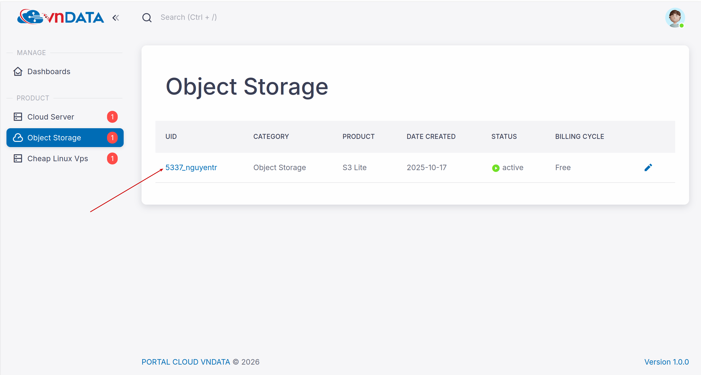
* Click **Buckets**
  
  
### 2.1 Quản lí tag cho bucket
* Để gắn tag cho bucket, ta thực hiện theo các bước sau đây:
  * Chọn dấu ```...``` -> **Details** -> **Tags**
    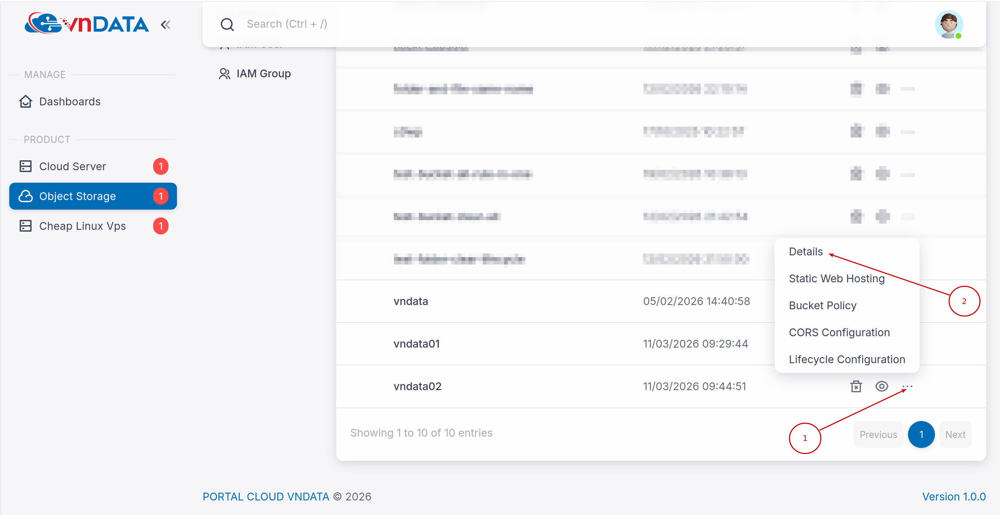
    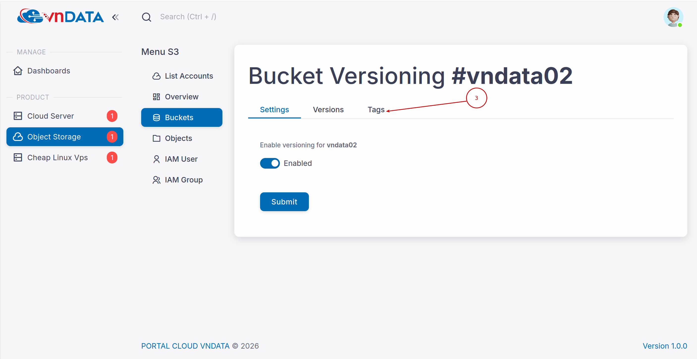
  * Điền tag key và tag value lần lượt vào ô **KEY** và **VALUE**
  * *(Ở trong ví dụ này thì sẽ điền **KEY** là **Name** và **VALUE** là **Bucket02**)*
    
    
    > Lưu ý: có thể chỉ cần điền chuỗi vào ô **KEY**; ô **VALUE** có thể để trống (ứng với chuỗi rỗng)
  
  * Bấm **Save Tags** để lưu tag lại cho bucket
    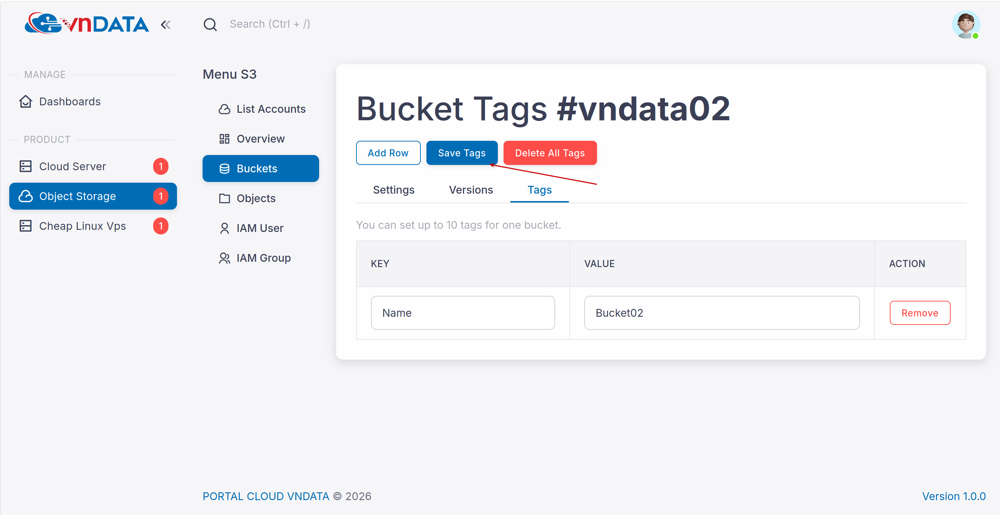
* Ví dụ: Chuyển dữ liệu bucket đã lọc theo bucket tag để chuyển sang tài khoản/endpoint S3 khác
  * Lọc theo mỗi **Tag KEY**
    
    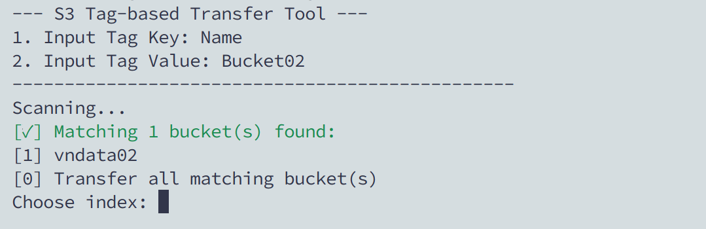
    
  * Lọc theo **Tag KEY** và **Tag VALUE**
    
    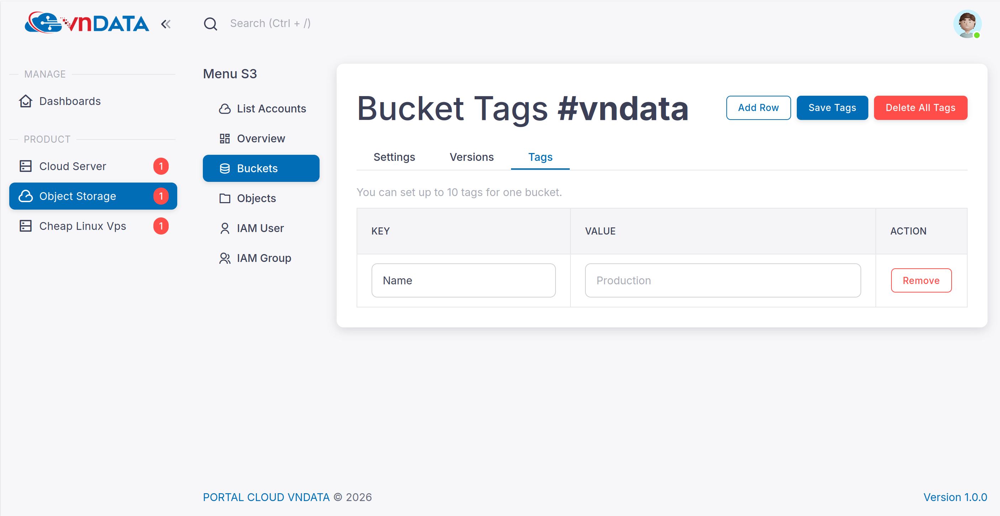

### 2.2 Quản lí tag cho file
* Để gắn tag cho file, ta thực hiện theo các bước sau đây:
  * Chọn bucket chứa file cần gắn tag
    
  * Tại file cần gắn tag -> Chọn **Details** -> Chọn **Tags**
    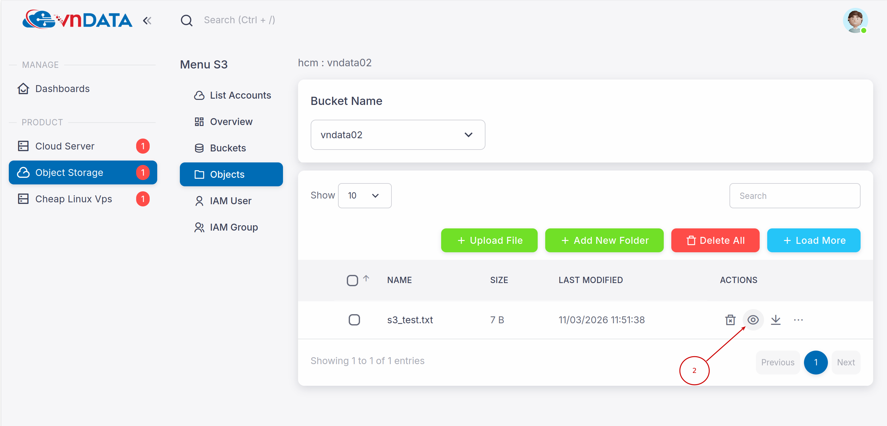
    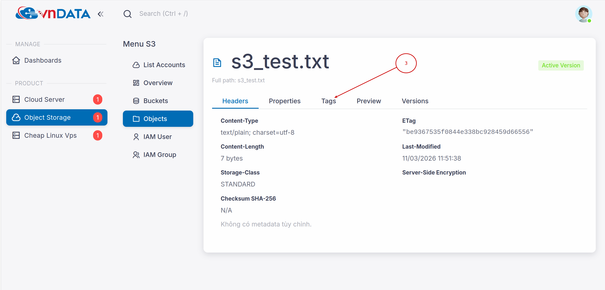
  * Điền tag vào ô **KEY**, **VALUE** 
  * *(Ở trong ví dụ này thì sẽ điền **KEY** là **File** và **VALUE** là **TEXT**)*
    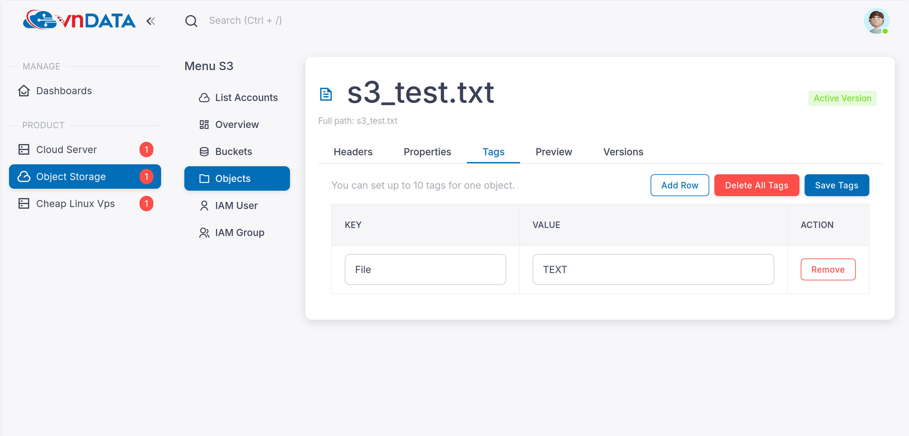

    > Lưu ý: tương tự như bucket; có thể chỉ cần điền chuỗi vào ô **KEY**, ô **VALUE** có thể để trống (ứng với chuỗi rỗng)

  * Bấm **Save Tags** để lưu tag lại cho file
    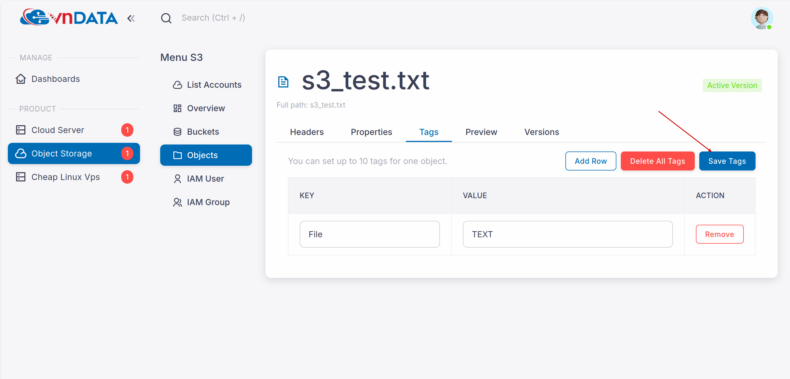
* Ví dụ: cấu hình lifecycle rule bao gồm tham số về tag cho các file trong bucket
  > Quý khách có thể tìm hiểu thêm về tính năng **Lifecycle Rules** qua [bài viết](https://wiki.vndata.vn/s3-object-storage/huong-dan-su-dung/s3-bucket-versioning/)
  * Tạo sẵn các file **001.txt, 002.txt, 003.txt, 004.txt** đều có tag với cặp **KEY:VALUE** tương ứng là **status:delete**
  * Cấu hình **Lifecycle Rules** cho các file như trong hình
    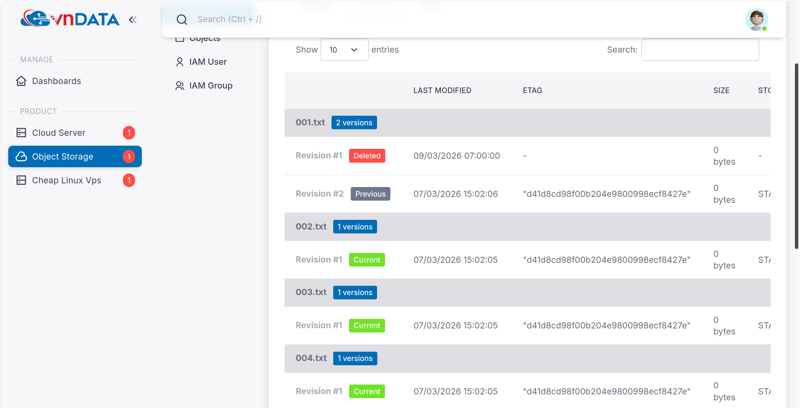
  * Kết quả:
    
  > Lưu ý: để để rule khớp file có tag thì cần cấu hình cả tag key và tag value tương ứng với file đó
  > * *Ví dụ với rule này thì không thể khớp với file 003.txt(có tag là status:delete)*
  >   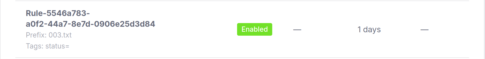
    
